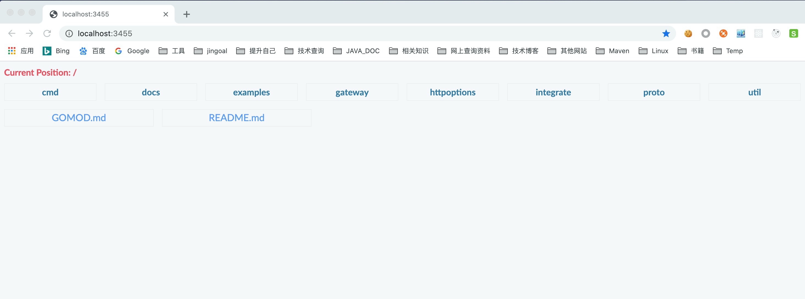
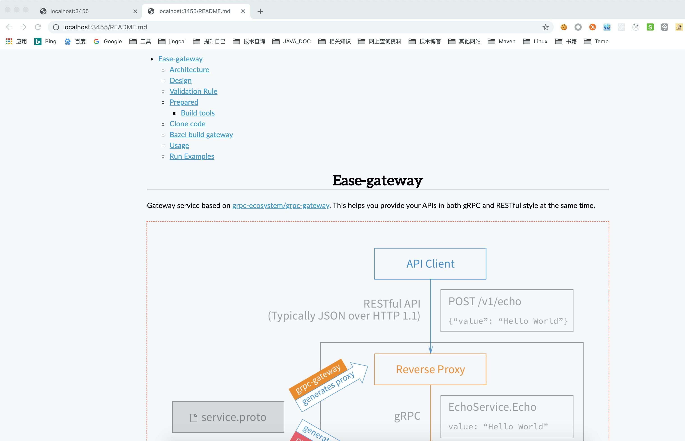

# Docular

Docular是一个个人文档服务，它提供了一个本地HTTP服务器来服务给定文件夹中的文档。该文件夹包含以下支持的文件格式：HTML，MarkDown，MAFF

## Install

Docular 在Linux 和 Mac 平台上都能很好的支持

### Download

- Linux

  [Docular Linux](https://github.com/binchencoder/docular/releases/download/v1.0/docular_1.0_amd64.deb)

  ```
  sudo dpkg -i docular_1.0_amd64.deb
  ```

- Mac

  [Docular Mac](https://github.com/binchencoder/docular/releases/download/v1.0/docular_1.0_darwin64.zip)

  > *NOTE*
  >
  > Mac上安装稍微麻烦一点，需要将webstatic 目录下载到本地，然后在运行时指定 -webstatic

## Launch

```
chenbin@chenbin-ThinkPad:~/$ docular -h
Docular server.

Usage:
  docular-server [options]

Options:
  -allow-external
    	Allow external access
  -doc-dir string
    	The doc directory path.
  -port int
    	The http port. (default 3455)
  -webstatic string
    	The web static directory. (default "/usr/share/docular/webstatic")
```

- 运行docular需要指定doc-dir，也就是你想预览的文件夹
- 可同时运行多个docular服务，需要制定port

## Screenshots





## References

- https://github.com/binchencoder/docular
- https://github.com/russross/blackfriday