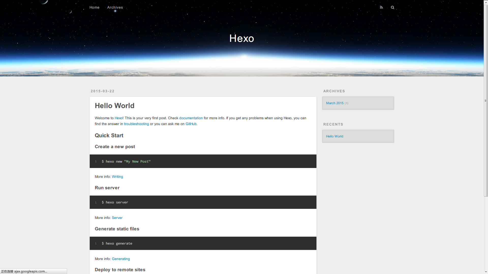

## 前言

“工欲善其事，必先利其器”，在搭建个人博客的过程中，我深刻体会到这句话的含义。虽然早就决定了要搭建个人博客，但是我并没有草草动手，而是提前做了大量的调研工作，包括采用哪种博客系统、选择哪种主题、怎么购买并绑定个性域名等等。事实证明，正因为前期的充分准备，搭建过程才能按部就班地进行。下面先介绍为何选择GitHub Pages和Hexo来搭建博客

## 准备

- Node js环境
- Git环境

<!--more-->

检查环境安装是否正确
```
chenbin@chenbin-ThinkPad:~$ node -v
v8.9.4

chenbin@chenbin-ThinkPad:~$ npm -v
5.6.0

chenbin@chenbin-ThinkPad:~$ git --version
git version 2.17.1
```
如果结果如上, 则说明安装正确， 可以进行下一步了。 如果不正确， 则需要回头检查自己的安装过程

## Install Hexo

```
$ npm install -g hexo-cli
```

Link:
[https://hexo.io/zh-cn/docs/index.html](https://hexo.io/zh-cn/docs/index.html)

## 建站

安装 Hexo 完成后，请执行下列命令，Hexo 将会在指定文件夹中新建所需要的文件。
```
$ hexo init <folder>
$ cd <folder>
$ npm install
```

> NOTE:
>
> Init <folder> 必须是完全空的目录. 不能存在任何文件, 包括隐藏文件

新建完成后，指定文件夹的目录如下：
```
.
├── _config.yml
├── package.json
├── scaffolds
├── source
|   ├── _drafts
|   └── _posts
└── themes
```

## 查看建站效果

自动根据当前目录下文件,生成静态网页
```
hexo g
```

运行本地服务, 出现以下结果说明本地服务运行成功. 这时就可以在浏览器输入http://localhost:4000/ 就可以看到效果了.
```
hexo s

chenbin@chenbin-ThinkPad:~/.../github-workspace/Hexo-code$ hexo s
INFO  Start processing
INFO  Hexo is running at http://localhost:4000/. Press Ctrl+C to stop.
```

效果图:



## Deploy

Hexo提供了快速方便的一键部署功能，让您只需一条命令就能将网站部署到服务器上。

```
$ hexo deploy
```

在开始之前，您必须先在 _config.yml 中修改参数，一个正确的部署配置中至少要有 type 参数，例如：
```
deploy:
  type: git
```

您可同时使用多个 deployer，Hexo 会依照顺序执行每个 deployer。
```
deploy:
- type: git
  repo:
- type: heroku
  repo:
```

> **缩进**
>
> YAML依靠缩进来确定元素间的从属关系。因此，请确保每个deployer的缩进长度相同，并且使用空格缩进。

详细说明请查看:
[https://hexo.io/zh-cn/docs/configuration.html](https://hexo.io/zh-cn/docs/configuration.html)

### Git Deploy

以下是我在本地使用Git Deploy配置的例子:
```
# Deployment
## Docs: https://hexo.io/docs/deployment.html
deploy:
  type: git
  repository: https://github.com/binchencoder/binchencoder.github.io.git
  branch: master
```

#### Install Git Deployer

安装 hexo-deployer-git
```
$ npm install hexo-deployer-git --save
```

安装成功之后就可以使用Git将网站部署到指定的服务器上
```
chenbin@chenbin-ThinkPad:~/.../github-workspace/Hexo-code$ hexo deploy
INFO  Deploying: git
INFO  Clearing .deploy_git folder...
INFO  Copying files from public folder...
INFO  Copying files from extend dirs...
位于分支 master
无文件要提交，干净的工作区
To https://github.com/binchencoder/binchencoder.github.io.git
   8a8903c..dac6bed  HEAD -> master
分支 'master' 设置为跟踪来自 'https://github.com/binchencoder/binchencoder.github.io.git' 的远程分支 'master'。
INFO  Deploy done: git
```

> 出现如上结果，就大功告成了。
>
> Hexo Hello-World网站已经部署到Git服务上。就可以通过https://binchencode.github.io 地址访问部署的网站了