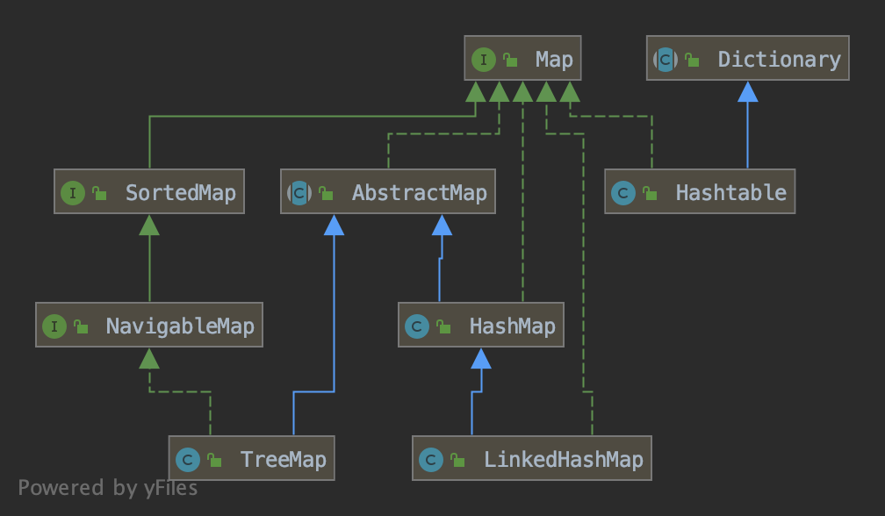
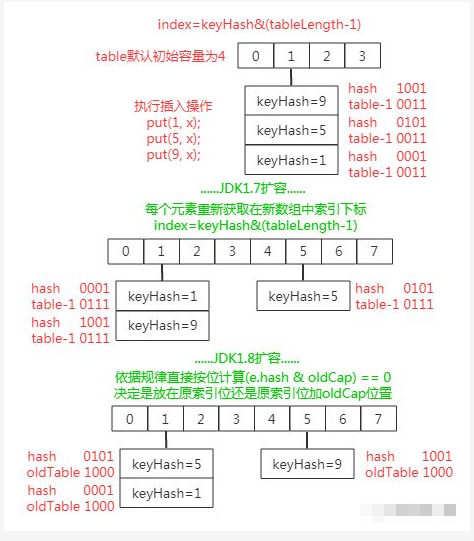

# 前言

掌握Java基础技能不仅能在工作中得心应手，在面试中也会占尽优势。相信大家在过去的面试过程中一定被问到过关于HashMap的知识，最近笔者也在准备面试，打算重新学习一遍Java集合的知识。在此带领大家一起来学习下

> HashMap是Java程序员使用频率最高的映射(键值对)处理的数据类型。随着JDK(Java Development Kit)版本的升级，JDK1.8对HashMap底层的实现进行了优化，例如引入红黑树的数据结构和扩容的优化等。

# Map接口类继承图



**说明：**

1. **HashMap：**它根据键的hashCode值存储数据，大多数情况下可以直接定位到它的值，因而具有很快的访问速度，但遍历顺序却是不确定的。 HashMap最多只允许一条记录的键为null，允许多条记录的值为null。HashMap非线程安全，即任一时刻可以有多个线程同时写HashMap，可能会导致数据的不一致。如果需要满足线程安全，可以用 Collections的synchronizedMap方法使HashMap具有线程安全的能力，或者使用ConcurrentHashMap。
2. **HashTable：**Hashtable是遗留类，很多映射的常用功能与HashMap类似，不同的是它承自Dictionary类，并且是线程安全的，任一时间只有一个线程能写Hashtable，并发性不如ConcurrentHashMap，因为ConcurrentHashMap引入了分段锁。Hashtable不建议在新代码中使用，不需要线程安全的场合可以用HashMap替换，需要线程安全的场合可以用ConcurrentHashMap替换。
3. **LinkedHashMap：**是HashMap的一个子类，保存了记录的插入顺序，在用Iterator遍历LinkedHashMap时，先得到的记录肯定是先插入的，也可以在构造时带参数，按照访问次序排序。
4. **TreeMap：**TreeMap实现SortedMap接口，能够把它保存的记录根据键排序，默认是按键值的升序排序，也可以指定排序的比较器，当用Iterator遍历TreeMap时，得到的记录是排过序的。如果使用排序的映射，建议使用TreeMap。在使用TreeMap时，key必须实现Comparable接口或者在构造TreeMap传入自定义的Comparator，否则会在运行时抛出java.lang.ClassCastException类型的异常。

## JDK1.8中HashMap是如何扩容的？与JDK1.7有什么区别

先来看图，以下是JDK1.7中HashMap的扩容机制：


> 1.7中的扩容过程会出现hash冲突

在JDK1.8中HashMap的扩容有很大的改进，由于扩容数组的长度是2倍的关系，所以对于假设初始 tableSize = 4 要扩容到 8 来说就是 0100 到 1000 的变化（左移一位就是 2 倍），**在扩容中只用判断原来的 hash 值与左移动的一位（newtable 的值）按位与操作是 0 或 1 就行，0 的话索引就不变，1 的话索引变成原索引加上扩容前数组**



**以下是JDK1.8源码核心实现：**

```Java
final Node<K, V>[] resize() {
  Node<K, V>[] oldTab = table;
  //记住扩容前的数组长度和最大容量
  int oldCap = (oldTab == null) ? 0 : oldTab.length;
  int oldThr = threshold;
  int newCap, newThr = 0;
  if (oldCap > 0) {
    //超过数组在java中最大容量就无能为力了，冲突就只能冲突
    if (oldCap >= MAXIMUM_CAPACITY) {
      threshold = Integer.MAX_VALUE;
      return oldTab;
    }
    //长度和最大容量都扩容为原来的二倍 
    else if ((newCap = oldCap << 1) < MAXIMUM_CAPACITY &&
             oldCap >= DEFAULT_INITIAL_CAPACITY) {
      newThr = oldThr << 1;
    }
    double threshold
  }
  //...... ......
  //更新新的最大容量为扩容计算后的最大容量
  threshold = newThr;
  //更新扩容后的新数组长度
  Node<K, V>[] newTab = (Node<K, V>[]) new Node[newCap];
  table = newTab;
  if (oldTab != null) {
    //遍历老数组下标索引
    for (int j = 0; j < oldCap; ++j) {
      Node<K, V> e;
      //如果老数组对应索引上有元素则取出链表头元素放在e中
      if ((e = oldTab[j]) != null) {
        oldTab[j] = null;
        //如果老数组j下标处只有一个元素则直接计算新数组中位置放置
        if (e.next == null) {
          newTab[e.hash & (newCap - 1)] = e;
        } else if (e instanceof TreeNode)
          //如果是树结构进行单独处理
        {
          ((TreeNode<K, V>) e).split(this, newTab, j, oldCap);
        } else {
          preserve order
            //能进来说明数组索引j位置上存在哈希冲突的链表结构
            Node<K, V> loHead = null, loTail = null;
          Node<K, V> hiHead = null, hiTail = null;
          Node<K, V> next;
          //循环处理数组索引j位置上哈希冲突的链表中每个元素
          do {
            next = e.next;
            //判断key的hash值与老数组长度与操作后结果决定元素是放在原索引处还是新索引
            if ((e.hash & oldCap) == 0) {
              //放在原索引处的建立新链表
              if (loTail == null) {
                loHead = e;
              } else {
                loTail.next = e;
              }
              loTail = e;
            } else {
              //放在新索引（原索引 + oldCap）处的建立新链表
              if (hiTail == null) {
                hiHead = e;
              } else {
                hiTail.next = e;
              }
              hiTail = e;
            }
          } while ((e = next) != null);
          if (loTail != null) {
            //放入原索引处 loTail.next = null;
            newTab[j] = loHead;
          }
          if (hiTail != null) {
            //放入新索引处
            hiTail.next = null;
            newTab[j + oldCap] = hiHead;
          }
        }
      }
    }
  }
  return newTab;
}
```

在 JDK1.7 中扩容操作时，哈希冲突的数组索引处的旧链表元素扩容到新数组时，如果扩容后索引位置在新数组的索引位置与原数组中索引位置相同，则链表元素会发生倒置（即如上面图1，原来链表头扩容后变为尾巴）；而在 JDK1.8 中不会出现链表倒置现象。

其次，由于 JDK1.7 中发生哈希冲突时仅仅采用了链表结构存储冲突元素，所以扩容时仅仅是重新计算其存储位置而已，而 JDK1.8 中为了性能在同一索引处发生哈希冲突到一定程度时链表结构会转换为红黑数结构存储冲突元素，故在扩容时如果当前索引中元素结构是红黑树且元素个数小于链表还原阈值（哈希冲突程度常量）时就会把树形结构缩小或直接还原为链表结构（其实现就是上面代码片段中的 split() 方法）。

## HashMap是如何避免key碰撞

### References

- https://www.cnblogs.com/faunjoe88/p/7992234.html
- https://www.cnblogs.com/xiaoxi/p/7233201.html