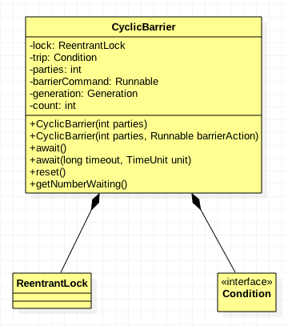
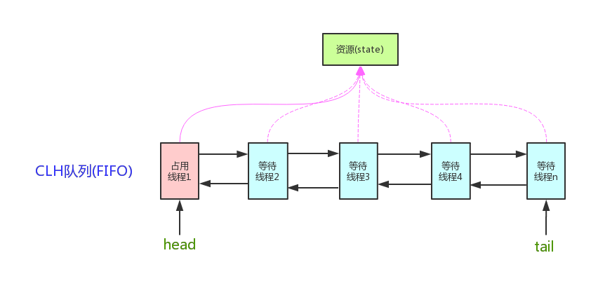

# 基础篇

## 基本功

1. 面向对象的特征
2. final, finally, finalize 的区别
   - https://www.jianshu.com/p/c45b6d782e91
3. 重载和重写的区别
4. 说说反射的用途及实现
5. equals 与 == 的区别

## 数据结构

1. [二叉树](https://www.cnblogs.com/ysocean/p/8032642.html)
2. [链表](https://www.cnblogs.com/ysocean/p/7928988.html)

## 集合

1. List 和 Set 区别
2. List 和 Map 区别
3. Arraylist 与 LinkedList 区别
4. ArrayList 与 Vector 区别
5. HashMap 和 Hashtable 的区别
6. HashSet 和 HashMap 区别
7. HashMap 和 ConcurrentHashMap 的区别
8. HashMap 的工作原理及代码实现
9. ConcurrentHashMap 的工作原理及代码实现
10. [HashMap是如何扩容的](https://binchencoder.github.io/2019/08/29/Java面试之基础篇%20-%20HashMap/#JDK1-8中HashMap是如何扩容的？与JDK1-7有什么区别)
11. [HashMap如何避免key碰撞](https://binchencoder.github.com/2019/08/29/Java面试之基础篇%20-%20HashMap/#HashMap是如何避免key碰撞)
12. HashMap死循环问题

# 进阶篇

## 网络

1. 讲讲TCP/IP
   - https://www.liaoxuefeng.com/wiki/897692888725344/923056618783712
2. 讲讲TCP、UDP、IP
   - https://segmentfault.com/a/1190000020121595
3. [TCP三次握手、四次握手](https://binchencoder.github.io/2019/08/31/TCP%E4%B8%89%E6%AC%A1%E6%8F%A1%E6%89%8B%E5%92%8C%E5%9B%9B%E6%AC%A1%E6%8F%A1%E6%89%8B/)

## IO

1. Java中IO流的分类

   - https://www.cnblogs.com/shuaiguoguo/p/8883862.html

2. NIO、BIO、AIO

   **See：** https://www.cnblogs.com/zedosu/p/6666984.html

   - BIO：同步阻塞式IO，服务器实现模式为一个连接一个线程，即客户端有连接请求时服务器端就需要启动一个线程进行处理，如果这个连接不做任何事情会造成不必要的线程开销，当然可以通过线程池机制改善。 
   - NIO：同步非阻塞式IO，服务器实现模式为一个请求一个线程，即客户端发送的连接请求都会注册到**多路复用器上**，多路复用器轮询到连接有I/O请求时才启动一个线程进行处理。
   - AIO(NIO 2.0)：异步非阻塞式IO，服务器实现模式为一个有效请求一个线程，客户端的IO请求都是由OS先完成了再通知服务器应用去启动线程进行处理。

## 线程

1. 说说 CountDownLatch 原理

   CountDownLatch是同步工具类之一，可以指定一个计数值，在并发环境下由线程进行减1操作，当计数值为0之后，被await方法阻塞的线程将会唤醒，实现线程间的同步。

   > **See** https://www.jianshu.com/p/7c7a5df5bda6

2. 说说 CyclicBarrier 原理

   

   > CyclicBarrier 字面意思是可循环（Cyclic）使用的屏障（Barrier）。它要做的事情是让一组线程到达一个屏障（同步点）时被阻塞，直到最后一个线程到达屏障时候，屏障才会开门。所有被屏障拦截的线程才会运行。
   >
   > **CyclicBarrier是由ReentrantLock可重入锁和Condition共同实现的。**

3. 说说 Semaphore 原理

4. 说说 Exchanger 原理

5. 说说 CountDownLatch 与 CyclicBarrier 区别

| CountDownLatch                                               | CyclicBarrier                                                |
| :----------------------------------------------------------- | ------------------------------------------------------------ |
| 减计数方式                                                   | 加计数方式                                                   |
| 计算为0时释放所有等待的线程                                  | 计数达到指定值时释放所有等待线程                             |
| 计数为0时，无法重置                                          | 计数达到指定值时，计数置为0重新开始                          |
| 调用countDown()方法计数减一，调用await()方法只进行阻塞，对计数没任何影响 | 调用await()方法计数加1，若加1后的值不等于构造方法的值，则线程阻塞 |
| 不可重复使用                                                 | 可重复利用                                                   |

> **CountDownLatch 强调的是一个线程（或多个）需要等待另外的n个线程干完某件事情之后才能继续执行。**
>
> 举个例子：有五个人，一个裁判。这五个人同时跑，裁判开始计时，五个人都到终点了，裁判喊停，然后统计这五个人从开始跑到最后一个撞线用了多长时间。 
>
> 我们实现代码的思路可能是这样：main线程是裁判，5个Worker是跑步的，运动员先准备，裁判喊跑，运动员才开始跑(这是第一次同步，对应begin)。5个人谁跑到终点了，countdown一下，直到5个人全部到达，裁判喊停(这是第二次同步，对应end)，然后算时间。 

> **CyclicBarrier强调的是n个线程，大家相互等待，只要有一个没完成，所有人都得等着。**

6. ThreadLocal 原理分析

7. 讲讲线程池的实现原理

8. 线程池的几种方式与使用场景

9. [线程的生命周期及几种状态](https://binchencoder.github.io/2018/08/31/Thread-State/)

## 锁机制

### 1. AQS详解

AQS是AbstractQueuedSynchronizer的简称。AQS提供了一种实现阻塞锁和一系列依赖FIFO等待队列的同步器的框架。AQS为一系列同步器依赖于一个单独的原子变量（state）的同步器提供了一个非常有用的基础。子类们必须定义改变state变量的protected方法，这些方法定义了state是如何被获取或释放的。

> **See** https://www.cnblogs.com/waterystone/p/4920797.html

### 2. 说说线程安全问题

### 3. volatile 实现原理

### 4. synchronize 实现原理

### 5. synchronized 与 lock 的区别

### 6. CAS 乐观锁

### 7. 乐观锁的业务场景及实现方式

### 8. ABA 问题

# 核心篇

## 数据存储

1. MySQL 索引使用的注意事项
2. 分库与分表带来的分布式困境与应对之策
3. 说说 SQL 优化之道
4. MySQL 遇到的死锁问题
5. 数据库索引的原理
6. B-tree与Hash索引的区别, 为什么要用 B-tree索引
7. 聚集索引与非聚集索引的区别
8. limit 20000 加载很慢怎么解决
9. 选择合适的数据存储方案
10. 聊聊 MongoDB 使用场景
11. 聊聊 ElasticSearch 使用场景
12. 倒排索引

## 缓存使用

1. Redis 有哪些类型
2. Redis 内部结构
3. Redis 内存淘汰机制 
	- http://blog.720ui.com/2016/redis_action_02_maxmemory_policy
4. 聊聊 Redis 使用场景
	- http://blog.720ui.com/2017/redis_core_use
5. Redis 持久化机制
   - http://blog.720ui.com/2016/redis_action_03_rdb_aof
6. Redis 集群方案与实现
   - http://blog.720ui.com/2016/redis_action_04_cluster
7. Redis 为什么是单线程的
8. 缓存崩溃
9. 缓存降级
10. 使用缓存的合理性问题
    - http://blog.720ui.com/2016/redis_action_01_use_core

## 消息队列

1. 消息队列的使用场景
2. 消息的重发补偿解决思路
3. 消息的堆积解决思路
4. 自己如何实现消息队列
5. 如何保证消息的有序性
6. Kafka为什么快
7. [Kafka是如何实现几十万的高并发写入](https://binchencoder.github.io/2019/08/28/kafka是如何实现几十万的高并发写入)

# 框架篇

## Spring

1. BeanFactory 和 ApplicationContext 有什么区别
2. Spring IOC 如何实现
3. 说说 Spring AOP
4. Spring AOP 实现原理
5. 动态代理（cglib 与 JDK）
6. Spring 事务实现方式
7. Spring 事务底层原理
8. Spring 其他产品（Srping Boot、Spring Cloud、Spring Secuirity、Spring Data、Spring AMQP 等）

## Netty

1. 为什么选择 Netty
2. 说说业务中，Netty 的使用场景
3. 原生的 NIO 在 JDK 1.7 版本存在 epoll bug
4. 什么是TCP 粘包/拆包
5. TCP粘包/拆包的解决办法
6. Netty 线程模型
7. 说说 Netty 的零拷贝
8. Netty 内部执行流程
9. Netty 重连实现

# 微服务篇

## 微服务

1. 微服务哪些框架

2. 如何解决跨域

   - http://blog.720ui.com/2016/web_cross_domain/

3. 你怎么理解 RPC 框架

   - [https://binchencoder.github.io/2019/07/21/RPC%E6%A1%86%E6%9E%B6/](https://binchencoder.github.io/2019/07/21/RPC框架/)

4. 说说 RPC 的实现原理

5. 说说 Dubbo 的实现原理

6. 你怎么理解 RESTful

7. 如何理解 RESTful API 的幂等性

   - http://blog.720ui.com/2016/restful_idempotent

8. 如何保证接口的幂等性

9. 说说 CAP 定理、 BASE 理论

   

10. 怎么考虑数据一致性问题

11. 说说最终一致性的实现方案

12. 微服务如何进行数据库管理

    - http://blog.720ui.com/2017/msa_design/

13. 如何应对微服务的链式调用异常

    - http://blog.720ui.com/2017/msa_design/

14. 对于快速追踪与定位问题

    - http://blog.720ui.com/2017/msa_design/

## 分布式

1. 谈谈业务中使用分布式的场景
2. Session 分布式方案
3. 分布式锁的场景
4. 分布是锁的实现方案
5. 分布式事务
6. 集群与负载均衡的算法与实现
7. 说说分库与分表设计
   - http://blog.720ui.com/2017/mysql_core_08_multi_db_table/
8. 分库与分表带来的分布式困境与应对之策
   - http://blog.720ui.com/2017/mysql_core_09_multi_db_table2/

# 高级进阶

## 算法

### 排序算法

**See** http://data.biancheng.net/sort/

1. [冒泡排序](https://www.runoob.com/w3cnote/bubble-sort.html)
2. [桶排序](https://www.runoob.com/w3cnote/bucket-sort.html)
3. [插入排序](https://www.runoob.com/w3cnote/insertion-sort.html)

## JVM

1. [JVM内存结构](https://binchencoder.github.io/2019/08/21/%E6%B7%B1%E5%85%A5%E7%90%86%E8%A7%A3JVM%20-%20%E5%86%85%E5%AD%98%E7%BB%93%E6%9E%84/)
2. [JVM内存管理](https://binchencoder.github.io/2019/08/11/JVM内存管理/)
3. JVM内存模型(JMM)
4. [JVM垃圾回收](https://binchencoder.github.io/2019/08/23/%E6%B7%B1%E5%85%A5%E7%90%86%E8%A7%A3JVM%20-%20%E5%9E%83%E5%9C%BE%E5%9B%9E%E6%94%B6/)
5. [JVM垃圾回收之世代垃圾收集过程](https://binchencoder.github.io/2019/08/24/%E6%B7%B1%E5%85%A5%E7%90%86%E8%A7%A3JVM%20-%20%E5%9E%83%E5%9C%BE%E5%9B%9E%E6%94%B6%E4%B9%8B%E4%B8%96%E4%BB%A3%E5%9E%83%E5%9C%BE%E6%94%B6%E9%9B%86%E8%BF%87%E7%A8%8B/)

## 性能优化

1. 性能指标有哪些
2. 如何发现性能瓶颈
3. 性能调优的常见手段
4. 说说你在项目中如何进行性能调优

# References

- http://blog.720ui.com/2018/java_interview_final

