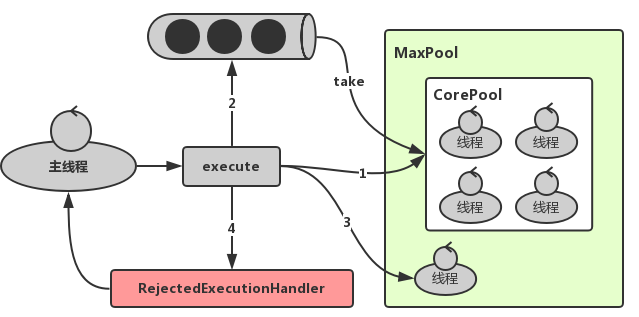

# 基础篇

## 基本功

1. 面向对象的特征
2. final, finally, finalize 的区别
   - https://www.jianshu.com/p/c45b6d782e91
3. 重载和重写的区别
4. 说说反射的用途及实现
   - https://www.sczyh30.com/posts/Java/java-reflection-1
5. equals 与 == 的区别

## 数据结构

1. [二叉树](https://www.cnblogs.com/ysocean/p/8032642.html)
2. [链表](https://www.cnblogs.com/ysocean/p/7928988.html)

## 集合

1. List 和 Set 区别
2. List 和 Map 区别
3. Arraylist 与 LinkedList 区别
4. ArrayList 与 Vector 区别
5. [HashMap、HashTable、ConcurrentHashMap共同点与区别](https://blog.csdn.net/heting717/article/details/103868691)
   - HashMap和HashTable 都是底层数组+链表实现，ConcurrentHashMap底层结构是散列表(数组+链表)+红黑树
   - HashMap可以存储null键和null值，HasTable和ConcurrentHashMap的key和value都不能为null
   - HasMap线程不安全，HashTable和ConcurrentHashMap是线程安全的。HashTable实现线程安全的方式是在修改数据时**锁住整个HashTable**，效率低，而ConcurrentHashMap作为一个高并发的容器，它是通过**部分锁定+CAS算法来进行实现线程安全的**。CAS算法也可以认为是**乐观锁**的一种
6. HashSet 和 HashMap 区别
7. [HashMap 的工作原理及代码实现](https://yikun.github.io/2015/04/01/Java-HashMap%E5%B7%A5%E4%BD%9C%E5%8E%9F%E7%90%86%E5%8F%8A%E5%AE%9E%E7%8E%B0/)
8. [ConcurrentHashMap 的工作原理及代码实现](https://www.cnblogs.com/heqiyoujing/p/10928423.html)
9. [HashMap是如何扩容的](https://binchencoder.github.io/2019/08/29/Java面试之基础篇%20-%20HashMap/#JDK1-8中HashMap是如何扩容的？与JDK1-7有什么区别)
10. [HashMap如何避免key碰撞](https://binchencoder.github.com/2019/08/29/Java面试之基础篇%20-%20HashMap/#HashMap是如何避免key碰撞)
11. [HashMap死循环问题](https://www.jianshu.com/p/1e9cf0ac07f4)

# 进阶篇

## 网络

1. 讲讲TCP/IP
   - [TCP/IP简介](https://www.liaoxuefeng.com/wiki/897692888725344/923056618783712)
2. 讲讲TCP、UDP、IP
   - [IP、UDP和TCP的关系](https://segmentfault.com/a/1190000020121595)
3. [TCP三次握手、四次握手](https://binchencoder.github.io/2019/08/31/TCP%E4%B8%89%E6%AC%A1%E6%8F%A1%E6%89%8B%E5%92%8C%E5%9B%9B%E6%AC%A1%E6%8F%A1%E6%89%8B/)
   - https://note.youdao.com/ynoteshare1/index.html?id=0e999579be9f295f0d895930c98a67b9&type=note

## IO

1. Java中IO流的分类

   - [Java 常用IO流操作详解](https://www.cnblogs.com/shuaiguoguo/p/8883862.html)

2. NIO、BIO、AIO

   **See：**[关于BIO和NIO的理解](https://www.cnblogs.com/zedosu/p/6666984.html)

   - BIO：同步阻塞式IO，服务器实现模式为一个连接一个线程，即客户端有连接请求时服务器端就需要启动一个线程进行处理，如果这个连接不做任何事情会造成不必要的线程开销，当然可以通过线程池机制改善。 
   - NIO：同步非阻塞式IO，服务器实现模式为一个请求一个线程，即客户端发送的连接请求都会注册到**多路复用器上**，多路复用器轮询到连接有I/O请求时才启动一个线程进行处理。
   - AIO(NIO 2.0)：异步非阻塞式IO，服务器实现模式为一个有效请求一个线程，客户端的IO请求都是由OS先完成了再通知服务器应用去启动线程进行处理。

## 线程

> References [Java线程模型](https://www.cnblogs.com/nevermorewang/p/9461410.html)

1. 说说 CountDownLatch 原理

   CountDownLatch是同步工具类之一，可以指定一个计数值，在并发环境下由线程进行减1操作，当计数值为0之后，被await方法阻塞的线程将会唤醒，实现线程间的同步。

   > **See** [分析CountDownLatch的实现原理](https://www.jianshu.com/p/7c7a5df5bda6)
   >
   > **My Sample: **https://github.com/binchencoder/java-tutorials/blob/master/src/test/java/com/binchencoder/study/concurrent/CountDownLatchTest.java
2. 说说 CyclicBarrier 原理

   

   > CyclicBarrier 字面意思是可循环（Cyclic）使用的屏障（Barrier）。它要做的事情是让一组线程到达一个屏障（同步点）时被阻塞，直到最后一个线程到达屏障时候，屏障才会开门。所有被屏障拦截的线程才会运行。
   >
   > **CyclicBarrier是由ReentrantLock可重入锁和Condition共同实现的。**
   >
   > **My Sample: **https://github.com/binchencoder/java-tutorials/blob/master/src/test/java/com/binchencoder/study/concurrent/CyclicBarrierTest.java

3. 说说 Semaphore 原理

   Semaphore也叫信号量, 在JDK1.5被引入, 可以用来控制同时访问特定资源的线程数量, 通过协调各个线程, 以保证合理的使用资源.

   Semaphore内部维护了一组虚拟的许可, 许可的数量可以通过构造函数的参数指定.

   - 访问特定资源前, 必须使用acquire方法获得许可, 如果许可数量为0, 该线程则一直阻塞, 直到有可用的许可
   - 访问资源后, 使用release释放许可

   Semaphore和ReentrantLock类似，获取许可有公平策略和非公平许可策略，默认情况下使用非公平策略

   > **应用场景 :**
   >
   > Semaphore可以用来做流量分流，特别是对公共资源有限的场景，比如数据库连接。
   > 假设有这个的需求，读取几万个文件的数据到数据库中，由于文件读取是IO密集型任务，可以启动几十个线程并发读取，但是数据库连接数只有10个，这时就必须控制最多只有10个线程能够拿到数据库连接进行操作。这个时候，就可以使用Semaphore做流量控制
   >
   > **My Sample: **https://github.com/binchencoder/java-tutorials/blob/master/src/test/java/com/binchencoder/study/concurrent/PrintABC.java

4. 说说 Exchanger 原理

5. 说说 CountDownLatch 与 CyclicBarrier 区别

| CountDownLatch                                               | CyclicBarrier                                                |
| :----------------------------------------------------------- | ------------------------------------------------------------ |
| 减计数方式                                                   | 加计数方式                                                   |
| 计算为0时释放所有等待的线程                                  | 计数达到指定值时释放所有等待线程                             |
| 计数为0时，无法重置                                          | 计数达到指定值时，计数置为0重新开始                          |
| 调用countDown()方法计数减一，调用await()方法只进行阻塞，对计数没任何影响 | 调用await()方法计数加1，若加1后的值不等于构造方法的值，则线程阻塞 |
| 不可重复使用                                                 | 可重复利用                                                   |

> **CountDownLatch 强调的是一个线程（或多个）需要等待另外的n个线程干完某件事情之后才能继续执行。**
>
> 举个例子：有五个人，一个裁判。这五个人同时跑，裁判开始计时，五个人都到终点了，裁判喊停，然后统计这五个人从开始跑到最后一个撞线用了多长时间。 
>
> 我们实现代码的思路可能是这样：main线程是裁判，5个Worker是跑步的，运动员先准备，裁判喊跑，运动员才开始跑(这是第一次同步，对应begin)。5个人谁跑到终点了，countdown一下，直到5个人全部到达，裁判喊停(这是第二次同步，对应end)，然后算时间。 

> **CyclicBarrier强调的是n个线程，大家相互等待，只要有一个没完成，所有人都得等着。**

6. ThreadLocal 原理分析

   **用于防止对可变的单实例变量或全局变量进行共享**

   **See** [ThreadLocal源码解读](https://www.cnblogs.com/micrari/p/6790229.html)

7. 讲讲线程池的实现原理

   **See** [深入分析java线程池的实现原理](https://www.jianshu.com/p/704a6c5d337c)

   

8. 线程池的几种方式与使用场景

9. [线程的生命周期及几种状态](https://binchencoder.github.io/2018/08/31/Thread-State/)

## 锁机制

1. AQS详解

AQS是AbstractQueuedSynchronizer的简称。AQS提供了一种实现阻塞锁和一系列依赖FIFO等待队列的同步器的框架。AQS为一系列同步器依赖于一个单独的原子变量（state）的同步器提供了一个非常有用的基础。子类们必须定义改变state变量的protected方法，这些方法定义了state是如何被获取或释放的。

> **See** [Java并发之AQS详解](https://www.cnblogs.com/waterystone/p/4920797.html)

2. 说说线程安全问题

   某个属性是被多线程共享的资源，同时多线程有读写操作，**就有可能（注意是有可能）**存在线程安全问题。

   > 即使是有多线程对同一个共享资源都有读写，也不能笼统的说就一定存在线程安全问题
   >
   > 要考虑线程安全问题并不代表一定就有线程安全问题。仿佛有点矛盾。判断存不存在线程安全问题，还要根据业务特点和发生问题导致的结果来判断。

3. volatile 实现原理

  如果一个字段被声明成volatile，java线程内存模型确保所有线程看到这个变量的值是一致的。这个就是所谓的“可见性”，就是一个线程修改了，其他线程能知道这个操作，这就是**可见性**。如何实现的呢？volatile修饰的变量在生成汇编代码的时候，会产生一条lock指令，lock前缀的指令在多核处理器下会引发两件事情：
  - 将当前处理器缓存行的数据写回到系统内存；
  - 这个写回内存的操作会使得在其它cpu里缓存了该内存地址的数据无效。

  **See** [volatile与synchronized实现原理](https://www.cnblogs.com/nevermorewang/p/9864797.html)

4. synchronized 实现原理

   synchronized是用java的monitor机制来实现的，就是synchronized代码块或者方法进入及退出的时候会生成monitorenter跟monitorexit两条命令。线程执行到monitorenter时会尝试获取对象所对应的monitor所有权，即尝试获取的对象的锁；monitorexit即为释放锁。

5. [synchronized 与 lock 的区别](https://binchencoder.github.io/2019/09/05/synchronized%E5%92%8Clock/)

6. CAS 乐观锁

7. 乐观锁的业务场景及实现方式

8. ABA 问题

# 核心篇

## 数据存储

1. [MySQL 索引使用的注意事项](https://www.jianshu.com/p/aedf4c0972e8)

3. 说说 SQL 优化之道

   > 1. 负向条件(where != 条件)不能使用索引，可以优化为`in` 查询；
   >
   > 2. Like 模糊查询左匹配不能使用索引, 只有右匹配能使用索引；
   >
   > 3. 数据区分度不大的字段不宜使用索引，如：性别只有男，女，每次过滤掉的数据很少，不宜使用索引；
   >
   > 4. 在属性上进行计算不能命中索引；
   >
   > 其他实践 **See** https://www.jianshu.com/p/906fd3ca8dc7

4. [MySQL 遇到的死锁问题](https://www.cnblogs.com/LBSer/p/5183300.html)

   > **如何避免死锁：**
   >
   > 1. 以固定的顺序访问表和行；
   > 2. 大事务拆小。大事务更倾向于死锁，如果业务允许，将大事务拆小；
   > 3. 在同一个事务中，尽可能做到一次锁定所需要的所有资源，减少死锁概率；
   > 4. 降低隔离级别。如果业务允许，将隔离级别调低也是较好的选择，比如将隔离级别从RR调整为RC，可以避免掉很多因为gap锁造成的死锁；
   > 5. 为表添加合理的索引。可以看到如果不走索引将会为表的每一行记录添加上锁，死锁的概率大大增大。

5. 数据库索引的原理

   - [数据库-索引的原理（面试高危之必备技能）](https://www.jianshu.com/p/4c2a2b0ef3e0)

6. BTREE与HASH索引的区别, 为什么要用 BTREE索引

   > **Hash 索引**只能够用于使用 = 或者 <=> 运算符的相等比较(但是速度更快)。Hash 索引不能够用于诸如 < 等用于查找一个范围值的比较运算符；
   >
   > **B-tree 索引**可以用于使用 =, >, >=, <, <= 或者 BETWEEN 运算符的列比较。如果 LIKE 的参数是一个没有以通配符起始的常量字符串的话也可以使用这种索引。

   - [B-tree索引和Hash索引的区别](https://www.cnblogs.com/alphago-1/articles/6724207.html)

   - [MySQL索引（一）为什么要用B+树](https://mp.weixin.qq.com/s/dhGAUs-S3RbBaOL2yxh1Iw)

7. 聚集索引与非聚集索引的区别

   > **聚集索引：**数据行的物理顺序与列值(一般是主键的那一列)的逻辑顺序相同，一个表中只能有一个聚集索引。Mysql中聚集索引就是主键索引，如果没有主键，系统会自动创建一个隐含列作为表的聚集索引。
   >
   > **非聚集索引：**该索引中索引的逻辑顺序与磁盘上行的物理存储顺序不同，一个表中可以有多个非聚集索引。

   **See** [聚集索引与非聚集索引的总结](https://www.cnblogs.com/s-b-b/p/8334593.html)

8. limit 20000 加载很慢怎么解决

9. 选择合适的数据存储方案

10. 聊聊 MongoDB 使用场景

11. 聊聊 ElasticSearch 使用场景

12. [倒排索引](https://blog.csdn.net/jiaojiao521765146514/article/details/83750548)

    不是由记录来确定属性值，而是由属性值来确定记录的位置

13. 事务隔离级别

    - 未提交读(Read uncommitted)

    - 已提交读(Read committed **[RC]**)：只能读取到已经提交的数据

    - 可重复读(Repeatable read **[RR]**)：**在同一个事务内的查询都是事务开始时刻一致的，InnoDB默认级别**

    - 可串行化(Serializable)

> 我们较常用的是RC和RR

14. MySQL的事务隔离级别是如何实现的

    **每行数据**其实在数据库都是多个版本的，可能同一时间有很多事务在更新一条数据，事务在开始的时候会申请一个id，这个id是严格随着时间递增的，先开始的事务id总是小的，数据库的版本就是事务id的版本。

    [MySQL的事务隔离级别是怎么实现的？](https://blog.csdn.net/A1028151949/article/details/88430895)

### References

- https://notes.diguage.com/mysql/

## 缓存使用

1. Redis 有哪些类型

  > Redis支持五种数据类型：string（字符串），hash（哈希），list（列表），set（集合）及zset(sorted set：有序集合)

| 类型                 | 简介                                                   | 特性                                                         | 场景                                                         |
| :------------------- | :----------------------------------------------------- | :----------------------------------------------------------- | :----------------------------------------------------------- |
| String(字符串)       | 二进制安全                                             | 可以包含任何数据,比如jpg图片或者序列化的对象,一个键最大能存储512M | ---                                                          |
| Hash(字典)           | 键值对集合,即编程语言中的Map类型                       | 适合存储对象,并且可以像数据库中update一个属性一样只修改某一项属性值(Memcached中需要取出整个字符串反序列化成对象修改完再序列化存回去) | 存储、读取、修改用户属性                                     |
| List(列表)           | 链表(双向链表)                                         | 增删快,提供了操作某一段元素的API                             | 1,最新消息排行等功能(比如朋友圈的时间线) 2,消息队列          |
| Set(集合)            | 哈希表实现,元素不重复                                  | 1、添加、删除,查找的复杂度都是O(1) 2、为集合提供了求交集、并集、差集等操作 | 1、共同好友 2、利用唯一性,统计访问网站的所有独立ip 3、好友推荐时,根据tag求交集,大于某个阈值就可以推荐 |
| Sorted Set(有序集合) | 将Set中的元素增加一个权重参数score,元素按score有序排列 | 数据插入集合时,已经进行天然排序                              | 1、排行榜 2、带权重的消息队列                                |

2. Redis 内部结构

3. [Redis 内存淘汰机制](http://blog.720ui.com/2016/redis_action_02_maxmemory_policy)

  > **volatile-lru：**从已设置过期时间的数据集中挑选最近最少使用的数据淘汰
  >
  > **volatile-ttl：**从已设置过期时间的数据集中挑选将要过期的数据淘汰
  >
  > **volatile-random：**从已设置过期时间的数据集中任意选择数据淘汰
  >
  > **allkeys-lru：**从数据集中挑选最近最少使用的数据淘汰
  >
  > **allkeys-random：**从数据集中任意选择数据淘汰
  >
  > **no-enviction：**当内存达到限制的时候，不淘汰任何数据，不可写入任何数据集，所有引起申请内存的命令会报错

4. 聊聊 Redis 使用场景

  - http://blog.720ui.com/2017/redis_core_use

5. Redis 持久化机制

   > **RDB：** 这是Redis默认的持久化方式，按照一定的时间周期策略把内存的数据以快照的形式保存到硬盘的二进制文件；
   >
   > **AOF：** Redis会将每一个收到的写命令都通过Write函数追加到文件最后，类似于MySQL的binlog。当Redis重启是会通过重新执行文件中保存的写命令来在内存中重建整个数据库的内容。

   **See** http://blog.720ui.com/2016/redis_action_03_rdb_aof
   
6. Redis 集群方案与实现

   - [Redis实战（四） 集群机制](http://blog.720ui.com/2016/redis_action_04_cluster)

7. [Redis 为什么是单线程的](https://cloud.tencent.com/developer/article/1120615)

8. 缓存崩溃

9. 缓存降级

10. 使用缓存的合理性问题

    - http://blog.720ui.com/2016/redis_action_01_use_core

## 消息队列

1. 消息队列的使用场景
2. 消息的重发补偿解决思路
3. 消息的堆积解决思路
4. 自己如何实现消息队列
5. [如何保证消息的有序性](https://xie.infoq.cn/article/c84491a814f99c7b9965732b1)
6. Kafka为什么快
7. [Kafka是如何实现几十万的高并发写入](https://binchencoder.github.io/2019/08/28/kafka是如何实现几十万的高并发写入)

# 框架篇

## Spring

1. BeanFactory 和 ApplicationContext 有什么区别

2. Spring IOC 如何实现

3. 说说 Spring AOP

4. Spring AOP 实现原理

5. 动态代理（cglib 与 JDK）

   > JDK的动态代理机制只能代理实现了接口的类，而不能实现接口的类就不能实现JDK的动态代理，cglib是针对类来实现代理的，他的原理是对指定的目标类生成一个子类，并覆盖其中方法实现增强，但**因为采用的是继承，所以不能对final修饰的类进行代理。 **

6. Spring 事务实现方式

7. Spring 事务底层原理

8. Spring 其他产品（Srping Boot、Spring Cloud、Spring Secuirity、Spring Data、Spring AMQP 等）

## Netty

1. 为什么选择 Netty
2. 说说业务中，Netty 的使用场景
3. 原生的 NIO 在 JDK 1.7 版本存在 epoll bug
4. 什么是TCP 粘包/拆包
5. TCP粘包/拆包的解决办法
6. Netty 线程模型
   - [彻底搞懂 netty 线程模型](https://www.cnblogs.com/luoxn28/p/11875340.html)
7. 说说 Netty 的零拷贝
8. Netty 内部执行流程
9. Netty 重连实现

# 微服务篇

## 微服务

1. 微服务有哪些框架

2. 如何解决跨域

   - http://blog.720ui.com/2016/web_cross_domain/

3. 你怎么理解 RPC 框架

   - [https://binchencoder.github.io/2019/07/21/RPC%E6%A1%86%E6%9E%B6/](https://binchencoder.github.io/2019/07/21/RPC框架/)

4. 说说 RPC 的实现原理

5. 说说 Dubbo 的实现原理

6. 你怎么理解 RESTful

7. 如何理解 RESTful API 的幂等性

   - http://blog.720ui.com/2016/restful_idempotent

8. 如何保证接口的幂等性

9. 说说 CAP 定理、 BASE 理论

   
   
   - [分布式理论之BASE理论](https://segmentfault.com/a/1190000018019595)

10. 怎么考虑数据一致性问题

11. 说说最终一致性的实现方案

12. 微服务如何进行数据库管理

    - http://blog.720ui.com/2017/msa_design/#论微服务的数据库管理

13. 如何应对微服务的链式调用异常

    - http://blog.720ui.com/2017/msa_design/#应对微服务的链式调用异常

14. 对于快速追踪与定位问题

    - http://blog.720ui.com/2017/msa_design/#如何快速追踪与定位问题

## 分布式

1. 谈谈业务中使用分布式的场景

2. Session 分布式方案

3. 分布式锁的场景

4. 分布式锁的实现方案

   [三种实现分布式锁的方式](https://blog.csdn.net/wuzhiwei549/article/details/80692278)

   - 基于数据库实现排他锁
   - 基于redis实现
   - 基于zookeeper实现

5. 分布式事务

6. 集群与负载均衡的算法与实现

7. 说说分库与分表设计

   - http://blog.720ui.com/2017/mysql_core_08_multi_db_table/

8. 分库与分表带来的分布式困境与应对之策

   - http://blog.720ui.com/2017/mysql_core_09_multi_db_table2/

# 高级进阶

## 算法

### 排序算法

**See** http://data.biancheng.net/sort/

1. [冒泡排序](https://www.runoob.com/w3cnote/bubble-sort.html)
2. [桶排序](https://www.runoob.com/w3cnote/bucket-sort.html)
3. [插入排序](https://www.runoob.com/w3cnote/insertion-sort.html)

## JVM

> References [JVM8中内存基本操作](https://www.cnblogs.com/nevermorewang/p/9461417.html)

1. [JVM内存结构](https://binchencoder.github.io/2019/08/21/%E6%B7%B1%E5%85%A5%E7%90%86%E8%A7%A3JVM%20-%20%E5%86%85%E5%AD%98%E7%BB%93%E6%9E%84/)
2. [JVM内存管理](https://binchencoder.github.io/2019/08/11/JVM内存管理/)
3. [JVM内存模型(JMM)](https://www.jianshu.com/p/d3fda02d4cae)
   - [Java内存模型的基础](https://www.cnblogs.com/tydd/p/13460941.html)
4. [JVM垃圾回收](https://binchencoder.github.io/2019/08/23/%E6%B7%B1%E5%85%A5%E7%90%86%E8%A7%A3JVM%20-%20%E5%9E%83%E5%9C%BE%E5%9B%9E%E6%94%B6/)
5. [JVM垃圾回收之世代垃圾收集过程](https://binchencoder.github.io/2019/08/24/%E6%B7%B1%E5%85%A5%E7%90%86%E8%A7%A3JVM%20-%20%E5%9E%83%E5%9C%BE%E5%9B%9E%E6%94%B6%E4%B9%8B%E4%B8%96%E4%BB%A3%E5%9E%83%E5%9C%BE%E6%94%B6%E9%9B%86%E8%BF%87%E7%A8%8B/)

### References

- [Java 虚拟机底层原理知识总结](https://doocs.gitee.io/jvm/#/?id=java-虚拟机底层原理知识总结)

## 性能优化

1. 性能指标有哪些
2. 如何发现性能瓶颈
3. 性能调优的常见手段
4. 说说你在项目中如何进行性能调优

# 面试官拷问

1. 平时碰到系统CPU飙高和频繁GC，你会怎么排查？
   - [面试官问：平时碰到系统CPU飙高和频繁GC，你会怎么排查？](https://www.jianshu.com/p/cf3d157e245f)

# References

- [Java面试通关要点汇总集【终极版】](http://blog.720ui.com/2018/java_interview_final)
- [深入理解JVM-内存模型（jmm）和GC](https://www.jianshu.com/p/76959115d486)

