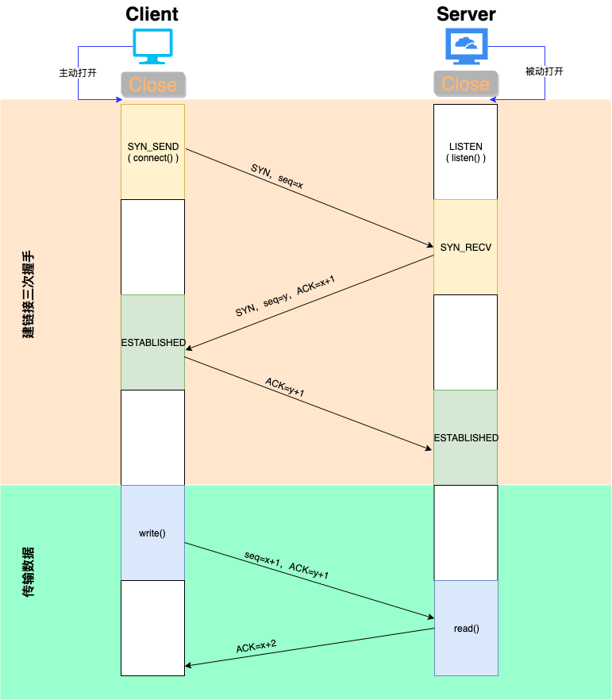
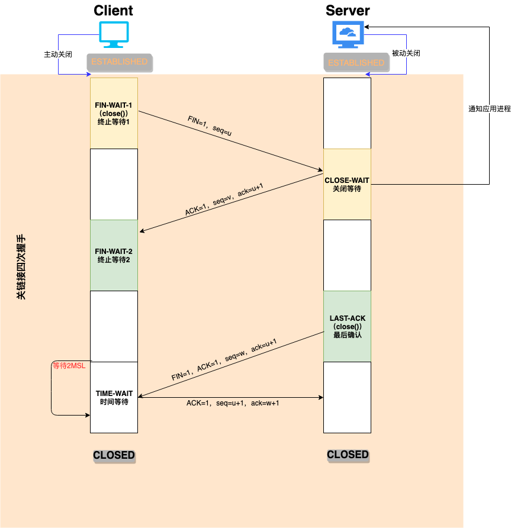

# 唠叨几句

笔者最近在进行跳槽的前期准备，把基础知识重新温故了一遍，整理了一篇[Java面试圣经](https://binchencoder.github.io/2019/08/28/Java%E9%9D%A2%E8%AF%95%E5%9C%A3%E7%BB%8F/#%E7%BD%91%E7%BB%9C)，估计很多人看到都会望而却步，停止跳槽的步伐 😅

这篇文章不仅适用于即将准备跳槽的Java程序猿朋友，也同样适用于希望扩充自己知识面的Java开发者。

在[Java面试圣经](https://binchencoder.github.io/2019/08/28/Java%E9%9D%A2%E8%AF%95%E5%9C%A3%E7%BB%8F/#%E7%BD%91%E7%BB%9C)，网络协议这一块属于`进阶篇`，属于基础偏上的内容。在本文中我们会深入学习下TCP协议

# TCP协议

说到TCP协议，大家应该能联想到`TCP/IP`，这是互联网世界中非常重要的一个名词。TCP/IP不是一个协议，而是一个协议族的统称。里面包括了IP协议、IMCP协议、TCP协议，以及我们更加熟悉的http、ftp、pop3协议等等。

本文我们主要介绍TCP协议，TCP 用于应用程序之间的通信。

当应用程序希望通过 TCP 与另一个应用程序通信时，它会发送一个通信请求。这个请求必须被送到一个确切的地址。在双方“握手”之后，TCP 将在两个应用程序之间建立一个全双工 (full-duplex) 的通信。

这个全双工的通信将占用两个计算机之间的通信线路，直到它被一方或双方关闭为止。

下面就来详细介绍TCP如何在计算机之间通信的。

# TCP三次握手

> TCP 三次握手就好比两个人在街上隔着50米看见了对方，但是因为雾霾等原因不能100%确认，所以要通过招手的方式相互确定对方是否认识自己。

> 上图包括两部分：建立链接、传输数据

**第一次握手** 

客户端发送`SYN包(seq=x)`到服务器，并进入**SYN_SEND**状态，等待服务器确认

> SYN：同步序列编号（Synchronize Sequence Numbers）

**第二次握手**

服务器收到SYN包，必须确认客户端的`SYN（ACK=x+1），同时自己也发送一个SYN包(seq=y)，`即`SYN+ACK包`，此时服务器进入**SYN_RECV**状态

**第三次握手**

客户端收到服务器的SYN+ACK包，向服务器发送确认包`ACK(ack=y+1)`，此包发送完毕，客户端和服务器进入**ESTABLISHED（TCP连接成功）** 状态，完成三次握手

> 最后通过动画演示一下

## 传输数据过程

**1.超时重传**

超时重传机制用来保证TCP传输的可靠性。每次发送数据包时，发送的数据报都有seq号，接收端收到数据后，会回复ack进行确认，表示某一seq 号数据已经收到。发送方在发送了某个seq包后，等待一段时间，如果没有收到对应的ack回复，就会认为报文丢失，会重传这个数据包。

**2.快速重传**

接受数据一方发现有数据包丢掉了。就会发送ack报文告诉发送端重传丢失的报文。如果发送端连续收到标号相同的ack包，则会触发客户端的快速重 传。比较超时重传和快速重传，可以发现超时重传是发送端在傻等超时，然后触发重传;而快速重传则是接收端主动告诉发送端数据没收到，然后触发发送端重传。

**3.流量控制**

这里主要说TCP滑动窗流量控制。TCP头里有一个字段叫Window，又叫Advertised-Window，这个字段是接收端告诉发送端自己 还有多少缓冲区可以接收数据。于是发送端就可以根据这个接收端的处理能力来发送数据，而不会导致接收端处理不过来。 滑动窗可以是提高TCP传输效率的一种机制。

**4.拥塞控制**

滑动窗用来做流量控制。流量控制只关注发送端和接受端自身的状况，而没有考虑整个网络的通信情况。拥塞控制，则是基于整个网络来考虑的。考虑一下这 样的场景：某一时刻网络上的延时突然增加，那么，TCP对这个事做出的应对只有重传数据，但是，重传会导致网络的负担更重，于是会导致更大的延迟以及更多 的丢包，于是，这个情况就会进入恶性循环被不断地放大。试想一下，如果一个网络内有成千上万的TCP连接都这么行事，那么马上就会形成“网络风 暴”，TCP这个协议就会拖垮整个网络。为此，TCP引入了拥塞控制策略。拥塞策略算法主要包括：慢启动，拥塞避免，拥塞发生，快速恢复。

# TCP四次握手

**第一次握手**

客户端进程发起连接释放报文，并且停止发送数据。释放数据报文首部，`FIN=1，其序列号为seq=u（等于前面已经传送过来的数据的最后一个字节的序号加1）`，此时，客户端进入**FIN-WAIT-1（终止等待1）状态**。 TCP规定，FIN报文段即使不携带数据，也要消耗一个序号。

**第二次握手**

服务器收到连接释放报文，发送确认报文，`ACK=1，ack=u+1`，并且带上自己的序列号seq=v，此时，服务器进入**CLOSE-WAIT（关闭等待）状态**。TCP服务器通知高层的应用程序，客户端向服务器的方向就释放了，这时候处于**半关闭状态**，即客户端已经没有数据要发送了。但是服务器若发送数据，客户端依然要接收。这个状态还要持续一段时间，也就是**CLOSE-WAIT状态**持续的时间。

客户端收到服务器的确认请求后，此时，客户端就进入**FIN-WAIT-2（终止等待2）状态**，等待服务器发送连接释放报文（在这之前还需要接受服务器发送的最后的数据）。

**第三次握手**

服务器将最后的数据发送完毕后，就向客户端发送连接释放报文，`FIN=1，ack=u+1`，由于在半关闭状态，服务器很可能又发送了一些数据，假定此时的序列号为seq=w，此时，服务器就进入了**LAST-ACK（最后确认）状态**，等待客户端的确认。

**第四次握手**

客户端收到服务器的连接释放报文后，必须发出确认，`ACK=1，ack=w+1`，而自己的序列号是`seq=u+1`，此时，客户端就进入了**TIME-WAIT（时间等待）状态**。注意此时TCP连接还没有释放，必须经过2∗∗MSL（最长报文段寿命）的时间后，当客户端撤销相应的TCB后，才进入**CLOSED状态**。

服务器只要收到了客户端发出的确认，立即进入CLOSED状态。同样，撤销TCB后，就结束了这次的TCP连接。可以看到，服务器结束TCP连接的时间要比客户端早一些。

> 最后通过动画演示一下

# 常见面试题

## 为什么连接的时候是三次握手，关闭的时候是四次握手？

因为当Server端收到Client端的SYN连接请求报文后，可以直接发送SYN+ACK报文。其中ACK报文是用来应答的，SYN报文是用来同步的。但是关闭连接时，当Server端收到FIN报文时，很可能并不会立即关闭SOCKET，所以只能先回复一个ACK报文，告诉Client端，"你发的FIN报文我收到了"。只有等到我Server端所有的报文都发送完了，我才能发送FIN报文，因此不能一起发送。故需要四步握手。

## 为什么不能用两次握手进行连接？

3次握手完成两个重要的功能，既要双方做好发送数据的准备工作(双方都知道彼此已准备好)，也要允许双方就初始序列号进行协商，这个序列号在握手过程中被发送和确认。

现在把三次握手改成仅需要两次握手，死锁是可能发生的。作为例子，考虑计算机S和C之间的通信，假定C给S发送一个连接请求分组，S收到了这个分组，并发 送了确认应答分组。按照两次握手的协定，S认为连接已经成功地建立了，可以开始发送数据分组。可是，C在S的应答分组在传输中被丢失的情况下，将不知道S 是否已准备好，不知道S建立什么样的序列号，C甚至怀疑S是否收到自己的连接请求分组。在这种情况下，C认为连接还未建立成功，将忽略S发来的任何数据分 组，只等待连接确认应答分组。而S在发出的分组超时后，重复发送同样的分组。这样就形成了死锁。

## 如果已经建立了连接，但是客户端突然出现故障了怎么办？

TCP还设有一个保活计时器，显然，客户端如果出现故障，服务器不能一直等下去，白白浪费资源。服务器每收到一次客户端的请求后都会重新复位这个计时器，时间通常是设置为2小时，若两小时还没有收到客户端的任何数据，服务器就会发送一个探测报文段，以后每隔75秒钟发送一次。若一连发送10个探测报文仍然没反应，服务器就认为客户端出了故障，接着就关闭连接。

# End

在我近期学习的过程中，我发现通过亲自画图的方式边学边理解，印象会更深刻。

> **故：接下来在我的文章中我都会尽可能挂上图片，提供给读者清俗易懂的文章，希望大家继续关注我的博客**
