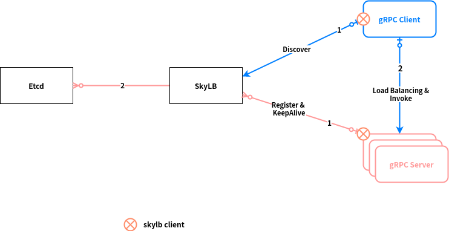

gRPC SkyLB
===

`gRPC` 作为一款高性能、通用的 RPC 框架，相比传统的RPC框架有着自己天然的优势：

1. protobuf二进制消息，性能好/效率高（空间和时间效率都很不错）；
2. proto文件生成目标代码，简单易用；
3. 序列化反序列化直接对应程序中的数据类，不需要解析后在进行映射(XML,JSON都是这种方式)；
4. 支持向前兼容（新加字段采用默认值）和向后兼容（忽略新加字段），简化升级；
5. 支持多种语言（可以把proto文件看做IDL文件）；
6. Netty等一些框架集成；

服务注册/发现 是RPC框架的核心组件，但是`gRPC` 作为企业级框架，他的开源组件官方并未直接提供服务注册与发现的功能实现。而是在设计文档([load-balancing.md](https://github.com/grpc/grpc/blob/master/doc/load-balancing.md))中提供了实现的思路，并在不同语言的`gRPC`代码API中提供了命名解析和负载均衡接口供扩展。

关于`gRPC` 服务发现&负载均衡的介绍，可以参见我之前写的一篇文章 [gRPC服务发现&负载均衡](https://binchencoder.github.io/2020/07/20/gRPC%E6%9C%8D%E5%8A%A1%E5%8F%91%E7%8E%B0&%E8%B4%9F%E8%BD%BD%E5%9D%87%E8%A1%A1/)

## Overview

*gRPC SkyLB* 采用独立LB进程（External Load Balancing Service）负载均衡方式，支持轮询、一致性哈希两种负载均衡策略，并支持服务端权重。采用etcd作为注册中心。

项目地址：

https://github.com/binchencoder/grpc-skylb

## Architecture of SkyLB



服务提供者起来后想注册中心(SkyLB) 注册自己的信息，ip、端口、权重等，并保持心跳。客户端监听注册中心，获取服务器列表，一旦服务器发生变化，客户端马上更新本地的服务器列表。客户端每个请求都通过负载均衡策略选择一个合适的服务器去访问。

## Demo

1. Implements gRPC API

   ```java
   public class DemoGrpcImpl extends DemoGrpc.DemoImplBase {
     private final Logger LOGGER = LoggerFactory.getLogger(DemoGrpcImpl.class);
   
     private Random rand = new Random(System.currentTimeMillis());
     private int port;
     public DemoGrpcImpl(int port_) {
       this.port = port_;
     }
   
     @Override
     public void greeting(GreetingProtos.GreetingRequest request,
         StreamObserver<GreetingProtos.GreetingResponse> responseObserver) {
       LOGGER.info("Got req: {}", request);
   
       // 随机耗时350~550毫秒.
       int elapse = 350 + rand.nextInt(200);
       try {
         TimeUnit.MILLISECONDS.sleep(elapse);
       } catch (InterruptedException ie) {
         LOGGER.warn("sleep interrupted");
       }
   
       GreetingResponse reply = GreetingResponse.newBuilder().setGreeting(
           "Hello " + request.getName() + ", from :" + port + ", elapse " + elapse + "ms").build();
       responseObserver.onNext(reply);
       responseObserver.onCompleted();
     }
   
     @Override
     public void greetingForEver(GreetingProtos.GreetingRequest request,
         StreamObserver<GreetingProtos.GreetingResponse> responseObserver) {
       super.greetingForEver(request, responseObserver);
     }
   }
   ```

2. Register gRPC Server to SkyLB Server

   ```java
   Server server = ServerTemplate.create({gRPC port} 9090, new DemoGrpcImpl(), 
                                         {serviceName} "shared-test-client-service")
     .build()
     .start();
   
   SkyLBServiceReporter reporter = ServerTemplate.reportLoad({skylbAddr} "skylb://127.0.0.1:1900/",
                                                             {serviceName} ServiceNameUtil.toString(ServiceId.CUSTOM_EASE_GATEWAY_TEST),
                                                             {portName} "grpc",
                                                             {gRPC port} 9090);
   ```

3. Call gRPC Server

   Create gRPC Stub

   ```java
   ManagedChannel channel = ClientTemplate.createChannel({skylbAddr} "skylb://127.0.0.1:1900/",
                                                         {calleeServiceName} ServiceNameUtil.toString(ServiceId.CUSTOM_EASE_GATEWAY_TEST),
                                                         {calleePortName} "grpc", 
                                                         {calleeNamespace} null,                                   
                                                         {callerServiceName} ServiceNameUtil.toString(ServiceId.SERVICE_NONE)).getOriginChannel();
   
   DemoGrpc.DemoBlockingStub blockingStub = DemoGrpc.newBlockingStub(channel);
   ```

   ```java
   GreetingRequest request = GreetingRequest.newBuilder()
     .setName("GC " + Calendar.getInstance().get(Calendar.SECOND))
     .build();
   GreetingResponse response = blockingStub
     .withDeadlineAfter(2000, TimeUnit.MILLISECONDS)
     .greeting(request);
   ```

## Run Demo

1. Build SkyLB Server

   ```shell
   chenbindeMacBook-Pro:grpc-skylb chenbin$ cd skylb-server
   chenbindeMacBook-Pro:skylb-server chenbin$ mvn clean package
   ```

   > 最终skylb.jar 打包到 skylb-server/target 目录下

2. Start SkyLB Server

   **Start ETCD**

   ```shell
   
   ```

   ```shell
   chenbindeMacBook-Pro:skylb-server chenbin$ cd target/skylblib
   
   chenbindeMacBook-Pro:skylblib chenbin$ java -jar skylb.jar -h
   	Usage: java -jar skylb.jar [options] [command] [command options]
     Options:
       --auto-disconn-timeout, -auto-disconn-timeout
         The timeout to automatically disconnect the resolve RPC. e.g. 10s(10 
         Seconds), 10m(10 Minutes)
         Default: PT5M
     Commands:
       etcd      Help for etcd options
         Usage: etcd [options]
           Options:
             --etcd-endpoints, -etcd-endpoints
               The comma separated ETCD endpoints. e.g., 
               http://etcd1:2379,http://etcd2:2379 
               Default: [http://127.0.0.1:2379]
             --etcd-key-ttl, -etcd-key-ttl
               The etcd key time-to-live. e.g. 10s(10 Seconds), 10m(10 Minutes)
               Default: PT10S
   
   chenbindeMacBook-Pro:skylblib chenbin$ java -jar skylb.jar -etcd-endpoints=http://127.0.0.1:2379
   ```

3. Start gRPC Server

4. Start gRPC Client

## References

- https://binchencoder.github.io/2020/07/20/gRPC%E6%9C%8D%E5%8A%A1%E5%8F%91%E7%8E%B0&%E8%B4%9F%E8%BD%BD%E5%9D%87%E8%A1%A1/
- https://github.com/binchencoder/grpc-skylb
- https://github.com/grpc/grpc/blob/master/doc/load-balancing.md