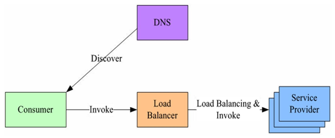
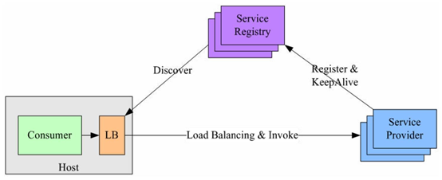

gRPC服务发现&负载均衡
====================
`gRPC` 是一个高性能、开源、通用的 RPC 框架，面向移动和 HTTP/2 设计，是由谷歌发布的首款基于 Protocol Buffers 的 RPC 框架。 `gRPC` 基于 HTTP/2 标准设计，带来诸如双向流、流控、头部压缩、单 TCP 连接上的多复用请求等特性。

构建高可用、高性能的通信服务，通常采用服务注册与发现、负载均衡和容错处理等机制实现。根据负载均衡实现所在的位置不同，通常可分为以下三种解决方案：

## 集中式LB（Proxy Model）

在服务消费和服务提供者之间有一个独立的LB，通常是专门的硬件设备如 F5，或者基于软件如 LVS，HAproxy等实现。

LB上有所有服务的地址映射表，通常由运维配置注册，当服务消费方调用某个目标服务时，它向LB发起请求，由LB以某种策略，比如轮询（Round-Robin）做负载均衡后将请求转发到目标服务。LB一般具备健康检查能力，能自动摘除不健康的服务实例。该方案主要问题：

1. 单点问题，所有服务调用流量都经过LB，当服务数量和调用量大的时候，LB容易成为瓶颈，且一旦LB发生故障影响整个系统
2. 服务消费方、提供方之间增加了一级，有一定性能开销

## 进程内LB（Balancing-aware Client）

针对第一个方案的不足，此方案将LB的功能集成到服务消费方进程里，也被称为软负载或者客户端负载方案。服务提供方启动时，首先将服务地址注册到服务注册表，同时定期报心跳到服务注册表以表明服务的存活状态，相当于健康检查，服务消费方要访问某个服务时，它通过内置的LB组件向服务注册表查询，同时缓存并定期刷新目标服务地址列表，然后以某种负载均衡策略 (Round Robin, Random, etc) 选择一个目标服务地址，最后向目标服务发起请求。LB和服务发现能力被分散到每一个服务消费者的进程内部，同时服务消费方和服务提供方之间是直接调用，没有额外开销，性能比较好。该方案主要问题：

1. 开发成本，该方案将服务调用方集成到客户端的进程里头，如果有多种不同的语言栈，就要配合开发多种不同的客户端，有一定的研发和维护成本
2. 另外生产环境中，后续如果要对客户库进行升级，势必要求服务调用方修改代码并重新发布，升级较复杂

## 独立 LB 进程（External Load Balancing Service）

该方案是针对第二种方案的不足而提出的一种折中方案，原理和第二种方案基本类似。
不同之处是将LB和服务发现功能从进程内移出来，变成主机上的一个独立进程。主机上的一个或者多个服务要访问目标服务时，他们都通过同一主机上的独立LB进程做服务发现和负载均衡。该方案也是一种分布式方案没有单点问题，一个LB进程挂了只影响该主机上的服务调用方，服务调用方和LB之间是进程内调用性能好，同时该方案还简化了服务调用方，不需要为不同语言开发客户库，LB的升级不需要服务调用方改代码。

该方案主要问题：部署较复杂，环节多，出错调试排查问题不方便

# gRPC服务发现&负载均衡实现

gRPC开源组件官方并未直接提供服务注册与发现的功能实现，但其设计文档已提供实现的思路，并在不同语言的gRPC代码API中已提供了命名解析和负载均衡接口供扩展。

其实现基本原理：

1. 服务启动后gRPC客户端向命名服务器发出名称解析请求，名称将解析为一个或多个IP地址，每个IP地址标示它是服务器地址还是负载均衡器地址，以及标示要使用那个客户端负载均衡策略或服务配置。
2. 客户端实例化负载均衡策略，如果解析返回的地址是负载均衡器地址，则客户端将使用grpclb策略，否则客户端使用服务配置请求的负载均衡策略。
3. 负载均衡策略为每个服务器地址创建一个子通道（channel）。
4. 当有RPC请求时，负载均衡策略决定那个子通道即`gRPC`服务器将接收请求，当可用服务器为空时客户端的请求将被阻塞。

根据gRPC官方提供的设计思路，基于进程内LB方案（即第2个案，阿里开源的服务框架 Dubbo 也是采用类似机制），结合分布式一致的组件（如Zookeeper、Consul、Etcd），可找到gRPC服务发现和负载均衡的可行解决方案。

## References

- https://github.com/grpc/grpc/blob/master/doc/load-balancing.md