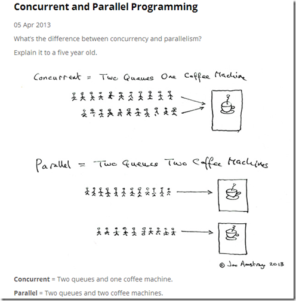
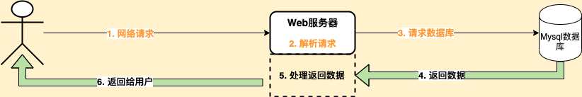

# 一、前言

作为2年以上的开发人员，如果还不理解`多线程`与`多进程`之间的区别，那你就赶紧停停手头的工作，回去好好复习吧

现在的程序设计中基本上都是多线程的，作为业务开发人员可能很多人都没有写过多线程的代码，因为这些高危的代码都由框架帮我们实现了，我们大多时间主要关注于实现自己的业务。但是如果搞懂多线程对于程序的调优和解决问题会很有帮助

在讲多线程之前，我先带领大家了解下其中的一些概念：

- **多线程**：指的是这个程序（一个进程）运行时产生了不止一个线程
- **并行与并发**：
  - 并行：多个cpu实例或者多台机器同时执行一段处理逻辑，是真正的同时
  - 并发：通过cpu调度算法，让用户看上去同时执行，实际上从cpu操作层面不是真正的同时。并发往往在场景中有公用的资源，那么针对这个公用的资源往往产生瓶颈，我们会用TPS或者QPS来反应这个系统的处理能力

 

# 二、 线程执行

**线程的执行，是由CPU进行调度的，一个CPU在同一时刻只会执行一个线程**

为了让用户感觉这些任务正在同时进行，**操作系统利用了时间片轮转的方式，CPU给每个任务都服务一定的时间，然后把当前任务的状态保存下来，在加载下一任务的状态后，继续服务下一任务。任务的状态保存及再加载，这段过程就叫做上下文切换**
 

# 三、为什么要用多线程

## 系统执行流程

上图是我们我们在设计Web系统中一个比较简单的流程：

> 1. 浏览器或者其他客户端发起网络请求
> 2. Web服务器解析请求
> 3. 请求后端的数据库获取数据
> 4. 数据库返回数据给应用服务，进行处理
> 5. 将处理之后的数据返回给客户端（用户）

下面我们一起来看下以上的这几步流程会涉及到什么计算机处理呢

> 1. 网络请求  ----->  网络IO
> 2. 解析请求  ----->  CPU
> 3. 请求数据库  ----->  网络IO
> 4. MySQL查询数据  ----->  磁盘IO
> 5. MySQL返回数据  ----->  网络IO
> 6. 数据处理  ----->  CPU
> 7. 返回数据给用户  ----->  网络IO

在真实业务中我们不单单会涉及CPU计算，还有网络IO和磁盘IO处理，这些处理是非常耗时的。如果一个线程整个流程是上图的流程，真正涉及到CPU的只有2个节点，其他的节点都是IO处理，那么线程在做IO处理的时候，CPU就空闲出来了，CPU的利用率就不高

## 多线程提高程序执行效率

1. 对于多核处理系统上，将要执行的任务分割成多个**可并行执行线程**，就可以提高执行速率

2. 对于单处理器上多线程只能并发执行而不是并行，并发原理，其实就是CPU快速来回切换，在特定的时间执行特定的某一个任务。并发执行存在着线程间上下文切换的问题，会消耗一定的时间。如果不考虑阻塞，多线程并发执行其实比单线程执行更加耗费时间，线程过多也会造成CPU负荷过大，并且线程占用内存资源，创建销毁线程也都是需要开销的

多线程通过提供CPU利用率来提高效率。数据库访问、磁盘IO等操作的速度比CPU执行代码速度慢很多，单线程环境下，这些操作会阻塞程序执行，导致CPU空转，因此对于会产生这些阻塞的程序来说，使用多线程可以避免在等待期间CPU的空转，提高CPU利用率
 

# 四、提升QPS/TPS

衡量系统性能如何，主要指标系统的（QPS/TPS）

1. QPS/TPS：每秒能够处理请求/事务的数量
2. 并发数：系统同时处理的请求/事务的数量
3. 响应时间：就是平均处理一个请求/事务需要时长

> QPS/TPS = 并发数/响应时间

上面公式代表并发数越大，QPS就越大；所以很多人就会以为调大线程池，并发数就会大，也会提升QPS

其实QPS还跟响应时间成反比，响应时间越大，QPS就会越小

虽然并发数调大了，就会提升QPS，但线程数也会影响响应时间，因为上面我们也提到了上下文切换的问题，那怎么设置线程数的呢？
 

# 五、如何设置线程数

**最佳线程数目 = （（线程等待时间+线程CPU时间）/线程CPU时间 ）* CPU数目**

> 备注这个公式也是前辈们分享的，当然之前看了淘宝前台系统优化实践的文章，和上面的公式很类似，不过在CPU数目那边，他们更细化了，上面的公式只是参考。不过不管什么公式，最终还是在生产环境中运行后，再优化调整

假如我们的服务器CPU核数为4核，一个任务线程cpu耗时为20ms，线程等待（网络IO、磁盘IO）耗时80ms，那最佳线程数目：( 80 + 20 )/20 * 4 = 20。也就是设置20个线程数最佳

从这个公式上面我们就得出，线程的等待时间越大，线程数就要设置越大，这个正好符合我们上面的分析，可提升CPU利用率。那从另一个角度上面说，线程数设置多大，是根据我们自身的业务的，需要自己去压力测试，设置一个合理的数值

## 设置线程数常规标准

用上面的最佳公式，我们可能还不能评估出设置的线程数。因为很多业务集中到一个线程池中，不像上面的案例比较简单，事实上业务太多，怎么设置呢？这个就是要去压力测试去调整。不过我们的前辈已经帮我们总结了一个基础的值（最终还是要看运行情况自行调整）

> 1. **CPU密集型：**操作内存处理的业务，一般线程数设置为：CPU核数 + 1 或者 CPU核数*2。核数为4的话，一般设置 5 或 8
> 2. **IO密集型：**文件操作，网络操作，数据库操作，一般线程设置为：cpu核数 / (1-0.9)，核数为4的话，一般设置 40

# 六、总结

讲到这里大家是不是对线程有了更新的了解呢？遇到性能问题，应该要去分析为什么这么慢，系统的瓶颈出现在什么地方，减少瓶颈的耗时

另外推荐大家再去了解下线程的生命周期、Redis的线程模型

- [线程生命周期] https://binchencoder.github.io/2018/08/31/Thread-State/
- [为什么redis 是单线程的] https://cloud.tencent.com/developer/article/1120615