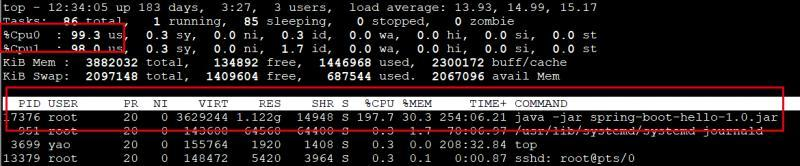
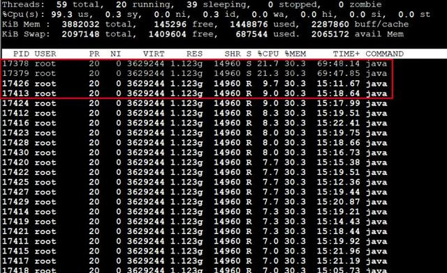
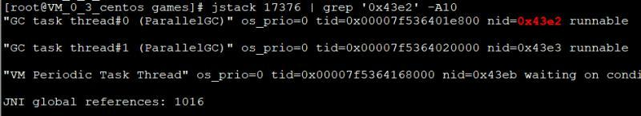
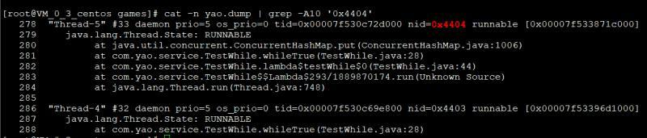
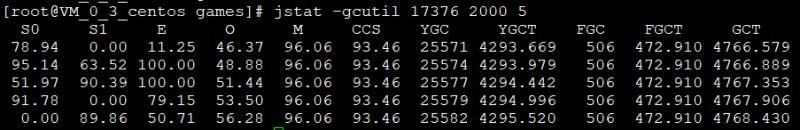

# 一、Overview

本篇文章针对的是排查Java程序出现高负载的情况，如果是其他语言写的程序，如：php、python、go，无非就是换个工具，排查的步骤是类似的

以下三类工具 从原生的top、jstack到功能强大的[Arthas](https://alibaba.github.io/arthas/) 和 一键式查找的[show-busy-java-threads](https://binchencoder.github.io/2018/07/22/UsefulScripts-Java%E8%84%9A%E6%9C%AC/show-busy-java-threads.sh)，它们都各有长处。在合适的环境选择合适的工具才是考察一个IT人员能力的时候。

## 1. 原生方法

Linux 原生命令：`top`、`printf`

JDK自带命令工具：`jstack`、`jstat`

### 1.1. 找到最耗CPU的进程

```sh
top -c
```

> **显示进程运行信息列表**
>
> 1. 按数字1，显示多核CPU信息
> 2. 键入P(大写p)，进程按照CPU使用率排序
> 3. 键入m，进程按照内存使用率排序



### 1.2. 找到最耗CPU的线程

```sh
top -H -p [PID]
```

> **显示一个进程的线程运行信息列表**

例：
```sh
top -Hp 17326
```

如下图所示，可以看到多个高耗CPU使用率的线程



### 1.3. 转换线程PID为十六进制

```sh
printf "%x\n" [线程PID]
```

> **转换多个线程数字为十六进制，使用时前面加0x**

例：

```sh
chenbindeMacBook-Pro:~ chenbin$ printf '%x\n' 17378 17379 17412 17426
43e2
43e3
4404
4412
```

### 1.4. **查看堆栈，定位线程**

```sh
jstack [进程PID] | grep [线程转换后十六进制] -A10
```

> **使用jstack获取进程PID堆栈，利用grep定位线程id，打印后续10行信息**

例：

```sh
jstack 17376 | grep '0x43e2' -A10
```



看上图中的“GC task thread#0 (ParallelGC)”，代表垃圾回收线程，该线程会负责进行垃圾回收。
为什么会有两个线程一直在进行垃圾回收，并且占用那么高的CPU使用率呢？

### 1.5. **存储堆栈，批量查看**

可以先将jstack堆栈信息存储起来

```sh
jstack [进程PID] > [文件]
```

例：

```
jstack 17376 > yao.dump
```

存储17376进程的堆栈信息，再使用cat + grep查找看看后面几个高CPU线程的堆栈信息。

```sh
cat -n yao.dump | grep -A10 '0x4404'
```



可以看到线程0x4404【线程17426】产生堆栈信息，直指方法whileTrue

### 1.6. **GC查看**

我们看到CPU占用率最高的并不是0x4404，而是0x43e2、0x43e3。但是并没法看到其中是什么类与方法，只有一条GC信息。

是不是死循环导致了GC太频繁，导致CPU使用率居高不下呢？
我们使用jstat看下jvm的GC信息看看。

```sh
jstat -gcutil [进程PID] [毫秒] [打印次数]
```

例：

```sh
jstat -gcutil 17376 2000 5
```

查看17376进程的GC信息，每2秒打印一次，共打印5次



可以看到Full GC的次数高达506次，Full GC的持续时间很长，平均每次Full GC耗时达到9秒（4766/506，即GCT/FGC）。

确实验证了我们之前的想法，再返回第4或第5步查看其他几个高CPU占用率线程，找到非GC信息的堆栈，查看具体的代码。

## 2. Arthas (阿里开源)

这是阿里开源出来的一个针对Java的线上诊断工具，功能非常强大，支持Linux/Mac/Windows，采用命令行交互模式

具体可以看我之前的一篇写[Arthas](http://binchencoder.github.io/2019/11/29/Arthas/)的文章


## 3. [show-busy-java-threads](https://binchencoder.github.io/2018/07/22/UsefulScripts-Java%E8%84%9A%E6%9C%AC/show-busy-java-threads.sh)

这个工具是useful-scripts 工具集的其中一个工具，用于快速排查Java CPU性能问题(top us值过高)，能自动查出运行Java进程中消耗CPU多的线程，并打印出其线程栈，从而确定导致性能问题的方法调用

> **NOTE：** 这个工具只能在Linux下使用

# 二、References

- https://alibaba.github.io/arthas/
- https://github.com/alibaba/arthas
- [https://binchencoder.github.io/2018/07/22/UsefulScripts-Java%E8%84%9A%E6%9C%AC/#show-busy-java-threads-sh](https://binchencoder.github.io/2018/07/22/UsefulScripts-Java脚本/#show-busy-java-threads-sh)