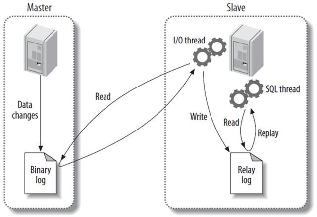

title: 如何查看MariaDB bin log
date: 2018-09-04 21:53:08
tags:
    - MariaDB
        - binlog
categories:

    - 存储
---

## MariaDB bin log

今天在学习MariaDB在产线的部署架构时，重新了解了主从复制的原理，同时产生想查看bin log的好奇心，折腾了一番最终搞定

## MariaDB主从复制



**MySQL的复制就是基于二进制日志而完成的，其工作原理如下：**

> 当MySQL的Master节点的数据有更改的时候，Master会主动通知Slave，让Slave主动来Master获取二进制日志，于是Slave开启一个I/O thread，向Master请求二进制日志中记录的语句；Master将二进制日志中记录的语句发给Slave，Slave则将这些语句存到中继日志中，进而从中继日志中读取一句，执行一句，直到所有的语句被执行完。而经SQL语句从中继日志中读取出来，再一一执行的进程叫做SQL thread；将这些语句执行完之后，从节点的数据就和主节点的数据相同了，这就是所谓的MySQL主从复制。

## 查看bin log

**在我们的一个测试环境上，通过如下命令查看**

```
MariaDB [(none)]> show binary logs;
1381 - You are not using binary logging

MariaDB [(none)]> show variables like 'log_bin';
+---------------+-------+
| Variable_name | Value |
+---------------+-------+
| log_bin | OFF |
+---------------+-------+

错误原因：测试环境中部署的实例没有开启bin log

MariaDB [(none)]> set global log_bin_trust_function_creators=1;

MariaDB [(none)]> show variables like 'log_bin_trust_function_creators';

+---------------------------------+-------+
| Variable_name | Value |
+---------------------------------+-------+
| log_bin_trust_function_creators | ON |
+---------------------------------+-------+

这样添加了参数以后，如果mysqld重启，那个参数又会消失，因此记得在my.cnf配置文件中添加：

log_bin_trust_function_creators=1

log_bin=mysql_bin

添加参数之后重启mysql
```

```
MariaDB [(none)]> show binary logs;
+------------------+-----------+
| Log_name | File_size |
+------------------+-----------+
| mysql_bin.000001 | 217795 |
+------------------+-----------+
```

```
[root@mariadb bin]# mysqlbinlog –no-defaults mysql-bin.00001;
/*!50530 SET @@SESSION.PSEUDO_SLAVE_MODE=1*/;
/*!40019 SET @@session.max_insert_delayed_threads=0*/;
/*!50003 SET @OLD_COMPLETION_TYPE=@@COMPLETION_TYPE,COMPLETION_TYPE=0*/;

DELIMITER /*!*/;
mysqlbinlog: File '' not found (Errcode: 2)

DELIMITER ;

# End of log file
ROLLBACK /* added by mysqlbinlog */;

/*!50003 SET COMPLETION_TYPE=@OLD_COMPLETION_TYPE*/;
/*!50530 SET @@SESSION.PSEUDO_SLAVE_MODE=0*/;
```

## 遗留问题

从上面Mariadb复制原理中我认为bin log记录的master上执行的sql语句，但是为什么bin log看不到呢？