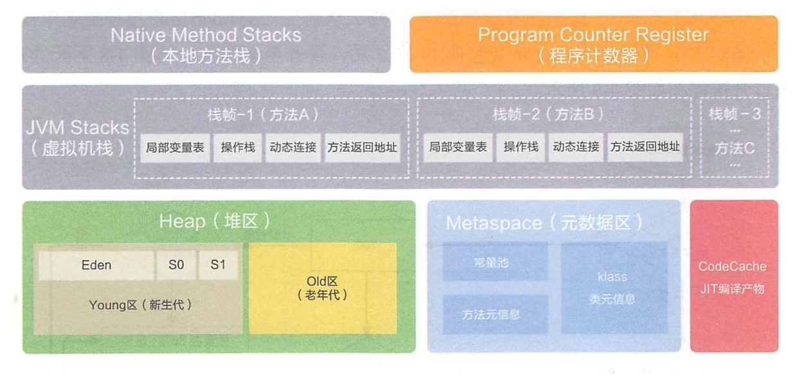

# 前言

在 [JVM内存结构](https://binchencoder.github.io/2019/08/21/%E6%B7%B1%E5%85%A5%E7%90%86%E8%A7%A3JVM%20-%20%E5%86%85%E5%AD%98%E7%BB%93%E6%9E%84/) 中我们详细讲解了JVM中的内存是如何分布和组成的。

我们已经知道JVM内存结构主要有三大块：`堆内存`、`方法区`和`栈内存`，而堆又是JVM中占用内存最大的一块，但是堆占用的空间也不是无限的(在JVM中会有参数来进行控制)，在程序运行的过程中，会不断的产生对象，导致堆的内存空间减少，这时我们会想到一定有一种机制来进行回收。接下来我们就一起来看看JVM是如何回收不再使用的对象空间的。


## 垃圾回收机制

#### Java垃圾回收主要关注堆



> Java内存运行时区域中的程序计数器、虚拟机栈、本地方法栈 都是线程私有的，因此它们的生命周期与线程的生命周期是一样的；栈中的栈帧随着方法的进入和退出有条无紊地执行着出栈和入栈操作。每一个栈帧中分配多少内存基本上是在类结构确定下来时就已知的（尽管在运行期会由JIT编译器进行一些优化）。因此这几个区域的内存分配和回收都具备确定性，不需要过多考虑回收的问题，因此方法结束或者线程结束时，内存自然就随着回收了。

而Java堆不一样，一个接口中的多个实现类需要的内存不一样，一个方法中的多个分支需要的内存也可能不一样，我们只有在程序处于运行期间时才能知道创建哪些对象，这部分内存的分配和回收都是动态的，垃圾收集器所关注的是这部分内存。

#### 判断需要被回收对象的方法

**引用计数法**

> 该方法简单高效，缺点是无法解决对象之间相互循环引用的问题

**可达性分析法**

> 解决了`引用计数法` 循环引用的问题


不可达的对象将暂时处于“缓刑”阶段，要真正宣告一个对象死亡，至少要经历两次标记过程

## 垃圾收集算法

**一共有四种：** `标记-清除算法`、`复制算法`、`标记-整理算法`、`分代收集算法`

### **标记-清除算法(Mark-Sweep)**

这是最基础的算法，分为“标记” 和 “清除” 两个阶段。首先**标记**出所有需要回收的对象，在标记完成后统一回收所有被标记的对象

**缺点：**
- 效率问题
- 空间问题，标记清除之后会产生大量不连续的内存碎片，空间碎片太多会导致以后需要分配较大的对象空间时，无法找到足够的连续内存而不得不提前触发另一次垃圾收集动作


### **复制算法(Copying)**

> 现在的商业虚拟机都采用这种算法来回收新生代

复制算法是为了为了解决效率的问题，它将可用内存分为大小相等的两块。每次只使用其中的一块。当这一块的内存用完了，就将还活着的对象复制到另外一块上，然后把已使用的内存空间一次性清理掉。

这个算法的缺点是可用内存缩小为原来的一半


### **标记-整理算法(Mark-Compact)**

复制算法在对象存活率较高的情况下要进行较多的复制操作，效率会降低。

复制算法并不适用于老年代，所以才有了`“标记-整理”` 算法，标记的过程与`“标记-清除”` 是一样的，第二步不是直接对可回收对象进行清理，而是让所有存活的对象都向一端移动，然后直接清理掉端便捷以外的内存


### **分代收集算法 (Generational Collection)**

现代商业虚拟机的垃圾收集都采用这一算法，它是根据对象存活周期的不同将内存划分为几块并采用不同的垃圾收集算法。

一般将Java堆分为**新生代**和**老年代**，这样就可以根据各个年代的特点采用最适当的收集算法。
- 新生代：每次垃圾收集时都发现有大批对象死去，只有少量存活，那就选用复制法，只需要付出少量存活对象的复制成本就可以完成收集
- 老年代：因为对象存活率高，没有额外空间对它进行分配担保，那就必须使用**标记-清理** 或者 **标记-整理** 算法来进行回收

## 垃圾回收器分类

如果垃圾收集算法是内存回收的方法论，那么垃圾收集器就是内存回收的具体实现


### Serial收集器(串行收集器)


> 这是一个单线程的收集器，它在进行垃圾收集时，必须暂停掉其他所有的工作线程，直到它收集结束（Stop The World）

### Serial Old收集器


这是Serial收集器是老年代版本，也是一个单线程，使用 **标记-整理** 算法。

### ParNew收集器(串行收集器)


> ParNew收集器是Serial收集器的多线程版本

除了使用多条线程进行垃圾收集之外，其余行为包括 Serial 收集器可用的所有控制参数（例如：-XX:SurvivorRatio、-XX:PretenureSizeThreshold、-XX:HandlePromotionFailure等）、收集算法、Stop The World、对象分配规则、回收策略等都与 Serial 收集器完全一样，在实现上，这两种收集器也共用了相当多的代码。

### Parallel Scavenge收集器(并行收集器)

这是一个新生代收集器，使用复制算法，又是并行的多线程收集器。Parallel Scavenge 收集器的目标是达到一个可控制的吞吐量(Througput)

> 吞吐量 = 运行用户代码时间 /（运行用户代码时间+垃圾收集时间），虚拟机总共运行了 100 分钟，其中垃圾收集花掉1分钟，那吞吐量就是99%

### Parallel Old收集器(并行收集器)


这是Parallel Scavenge收集器的老年代版本，使用多线程和**标记-整理算法**

**Sample:**

```
java -Xmx3800m -Xms3800m -Xmn2g -Xss128k -XX:+UseParallelGC -XX:ParallelGCThreads=20 
-XX:+UseParallelOldGC MaxGCPauseMillis=100 -XX:MaxGCPauseMillis=100
```

### CMS收集器(Concurrent Mark Sweep 并发标记扫描)


这是一种以获取最短回收停顿时间为目标的收集器

**步骤：**

1. 	初始标记（CMS initial mark）
2. 并发标记（CMS concurrent mark）
3. 重新标记（CMS remark）
4. 并发清除（CMS concurrent sweep）

> 初始标记、重新标记这两个步骤仍然需要"Stop The World"。

**优点：** 并发收集，低停顿

**缺点：**

1. 导致吞吐量降低：CMS收集器对CPU资源比较敏感，在并发阶段会占用一部分线程（或者说CPU资源）而导致应用程序变慢，总吞吐量降低
2. 无法处理浮动垃圾：可能出现"Concurrent Mode Failure"失败而导致另一次 Full GC（新生代和老年代同时回收） 的产生
3. 产生空间碎片：空间碎片过多时，将会给大对象分配带来很大麻烦，往往会出现老年代还有很大空间剩余，但是无法找到足够大的连续空间来分配当前对象，不得不提前触发一次 Full GC 

**Sample:**

```
java -Xmx3550m -Xms3550m -Xmn2g -Xss128k-XX:ParallelGCThreads=20  -XX:+UseConcMarkSweepGC 
-XX:+UseParNewGC  -XX:CMSFullGCsBeforeCompaction=5 -XX:+UseCMSCompactAtFullCollection
```

### G1收集器（Garbage-First）【重点】


G1 是一款面向服务端应用的垃圾收集器

**步骤：**

1. 初始标记（Initial Marking）
2. 并发标记（Concurrent Marking）
3. 最终标记（Final Marking）
4. 筛选回收（Live Data Counting and Evacuation）

**优点：**

1. 并行与并发：G1 能充分利用多 CPU、多核环境下的硬件优势，使用多个CPU（CPU或者CPU核心）来缩短 Stop-The-World 停顿的时间，部分其他收集器原本需要停顿 Java 线程执行的 GC 动作，G1 收集器仍然可以通过并发的方式让 Java 程序继续执行
2. 分代收集：能够采用不同的方式去处理新创建的对象和已经存活了一段时间、熬过多次 GC 的旧对象以获取更好的收集效果
3. 空间整合：G1从整体上看是基于“标记-整理”算法实现的，从局部（两个 Region 之间）上来看是基于“复制”算法实现的。这意味着G1运行期间不会产生内存碎片，收集后能提供规整的内存空间
4. 可预测的停顿：可建立可预测的停顿时间模型，能让使用者明确指定在一个长度为M毫秒的时间片段内，消耗在垃圾收集上的时间不得超过N毫秒

#### **Rerferences**

1. [大白话讲解Jvm的G1垃圾收集器](https://www.itqiankun.com/article/jvm-g1-memory-management-model)

## GC日志

阅读 GC 日志是处理 Java 虚拟机内存问题的基础技能，它只是一些人为确定的规则，没有太多技术含量。

每一种收集器的日志形式都是由它们自身的实现所决定的，换而言之，每个收集器的日志格式都可以不一样。但虚拟机设计者为了方便用户阅读，将各个收集器的日志都维持一定的共性，例如以下两段典型的 GC 日志：

```java
33.125:[GC[DefNew:3324K-＞152K（3712K），0.0025925 secs]3324K-＞152K（11904K），0.0031680 secs]
100.667:[Full GC[Tenured:0 K-＞210K（10240K），0.0149142secs]4603K-＞210K（19456K），[Perm:2999K-＞2999K（21248K）]，0.0150007 secs][Times:user=0.01 sys=0.00，real=0.02 secs]
```

最前面的数字`33.125：` 和 `100.667：` 代表了 GC 发生的时间，这个数字的含义是从 Java 虚拟机启动以来经过的秒数。

GC 日志开头的 `[GC` 和 `[Full GC` 说明了这次垃圾收集的停顿类型，而不是用来区分新生代 GC 还是老年代 GC 的。

如果有 `Full`，说明这次 GC 是发生了 Stop-The-World 的，例如下面这段新生代收集器 ParNew 的日志也会出现 `[Full GC`（这一般是因为出现了分配担保失败之类的问题，所以才导致 STW）。如果是调用 System.gc() 方法所触发的收集，那么在这里将显示 `[Full GC（System）`


```java
[Full GC 283.736:[ParNew:261599K-＞261599K（261952K），0.0000288 secs]
```

接下来的 `[DefNew`、`[Tenured`、`[Perm` 表示 GC 发生的区域，这里显示的区域名称与使用的 GC 收集器是密切相关的，例如上面样例所使用的 Serial 收集器中的新生代名为 "Default New Generation"，所以显示的是 `[DefNew`。如果是 ParNew 收集器，新生代名称就会变为 `[ParNew`，意为 "Parallel New Generation"。如果采用 `Parallel Scavenge` 收集器，那它配套的新生代称为 `PSYoungGen`，老年代和永久代同理，名称也是由收集器决定的。

后面方括号内部的 `3324K-＞152K（3712K）`含义是GC 前该内存区域已使用容量 -＞ GC 后该内存区域已使用容量 （该内存区域总容量）。而在方括号之外的 `3324K-＞152K（11904K）` 表示 `GC 前 Java 堆已使用容量 -＞ GC 后 Java 堆已使用容量 （Java 堆总容量）`

再往后，`0.0025925 secs` 表示该内存区域 GC 所占用的时间，单位是秒。有的收集器会给出更具体的时间数据，如 `[Times:user=0.01 sys=0.00，real=0.02 secs]` ，这里面的 user、sys 和 real 与 Linux 的 time 命令所输出的时间含义一致，分别代表用户态消耗的 CPU 时间、内核态消耗的 CPU 事件和操作从开始到结束所经过的墙钟时间（Wall Clock Time）

CPU 时间与墙钟时间的区别是，墙钟时间包括各种非运算的等待耗时，例如等待磁盘 I/O、等待线程阻塞，而 CPU 时间不包括这些耗时，但当系统有多 CPU 或者多核的话，多线程操作会叠加这些 CPU 时间，所以读者看到 user 或 sys 时间超过 real 时间是完全正常的

## 垃圾回收器的选择

**决定因素：**

1. 应用程序的场景
2. 硬件的制约
3. 吞吐量的需求

串行垃圾回收是最简单，但是效率最低的垃圾回收器。适用于控制台的单线程程序，简单任务。

并行垃圾回收器是64bit server默认的垃圾回收器，一般我们工作和产线上如果不配置，默认都是并行垃圾回收。对于一般的不要求吞吐的应用，并且硬件资源不是太充足的情况下，并行垃圾回收器差不多能满足需求。

**重点**

CMS垃圾回收器是对并行垃圾回收器的一个优化，它以CPU和系统资源为代价，换区GC的延迟。不会一GC就STW，而是根据情况STW。一定程度上是资源换取速度。

G1垃圾回收器是针对大Heap的垃圾回收器，如果heap分配的足够大，分的region的优先级回收策略会优先清理垃圾多的region。并且减少了内存空间碎片，分配大对象时不会因为无法找到连续的内存空间而提前触发下一次GC。

| **Option**              | **Description**                                              |
| ----------------------- | ------------------------------------------------------------ |
| -XX:+UseSerialGC        | Serial Garbage Collector 串行垃圾回收器                      |
| -XX:+UseParallelGC      | Parallel Garbage Collector并行垃圾回收器                     |
| -XX:+UseConcMarkSweepGC | CMS Garbage Collector并发标记垃圾回收器                      |
| -XX:ParallelCMSThreads= | CMS Collector – number of threads to use 并发标记垃圾回收器使用的线程数，通常是cpu个数 |
| -XX:+UseG1GC            | G1 Gargbage Collector 使用G1垃圾回收器                       |

### 垃圾收集器参数总结


## 查看垃圾回收器

```
chenbindeMacBook-Pro:BazelWorkspace chenbin$ java -XX:+PrintCommandLineFlags -version
-XX:InitialHeapSize=268435456 -XX:MaxHeapSize=4294967296 -XX:+PrintCommandLineFlags -XX:+UseCompressedClassPointers -XX:+UseCompressedOops -XX:+UseParallelGC
java version "1.8.0_112"
Java(TM) SE Runtime Environment (build 1.8.0_112-b16)
Java HotSpot(TM) 64-Bit Server VM (build 25.112-b16, mixed mode)
```

## 名词术语

1. **Full GC：**新生代和老年代同时回收

## References

- [Java垃圾回收](https://www.cnblogs.com/czwbig/p/11127159.html)

- [Java 垃圾回收机制](https://www.oschina.net/translate/java-gc)

